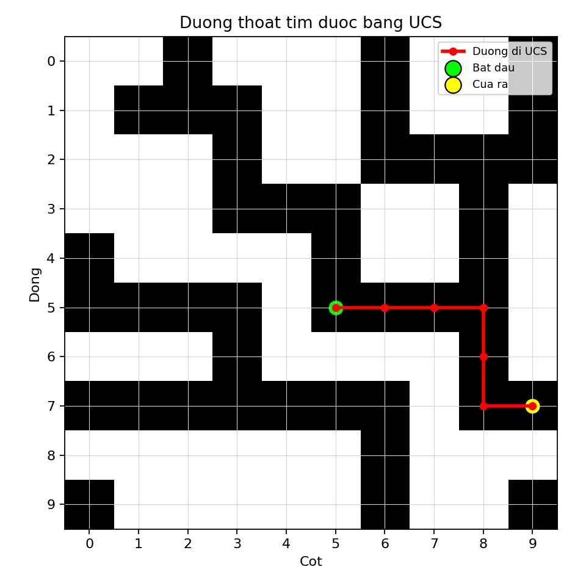

# Câu 1 - Báo cáo thuật toán UCS

## Đề bài

Một lâu đài cổ có hệ thống đường hầm bí mật, với một cửa vào duy nhất tại phòng trung tâm và nhiều cửa ra ở rìa lâu đài. Hai ô hầm chỉ nối với nhau nếu có chung cạnh.

Trong báo cáo này, em trình bày cách giải bài toán bằng thuật toán:

```text
UCS - Uniform Cost Search
```

File chương trình:

```text
cau1_ucs.py
```

File kết quả:

```text
UCS_out.csv
```

---

## Dữ liệu đầu vào

File `A_in.csv`:

```text
10,5,5
```

Ý nghĩa:

- `n = 10`: ma trận kích thước `10 x 10`.
- Điểm bắt đầu là `(5,5)`.
- Tọa độ dùng kiểu `0-based`.
- Ô `1` là ô đi được.
- Ô `0` là ô không đi được.

---

## a) Xác định hàm chi phí của UCS

### Trả lời: Minh họa giải thích hàm

UCS là viết tắt của **Uniform Cost Search**, nghĩa là tìm kiếm theo chi phí đồng nhất hoặc tìm kiếm theo chi phí nhỏ nhất.

UCS không dùng heuristic như A* hoặc Greedy. UCS chỉ dùng chi phí thực tế đã đi:

```text
g(x)
```

Trong bài toán tìm đường, `g(x)` biểu diễn tổng chi phí từ phòng trung tâm đến ô hiện tại `x`.

Trong bài toán mê cung này, mỗi lần đi từ một ô sang ô kề cạnh có chi phí:

```text
1
```

Vì vậy:

```text
g(x) = số bước từ phòng trung tâm đến ô x
```

UCS luôn chọn ô có chi phí `g(x)` nhỏ nhất để xét trước.

Ví dụ:

```text
g(5,5) = 0
g(5,6) = 1
g(5,7) = 2
g(5,8) = 3
```

Nếu tại một thời điểm có nhiều ô trong hàng đợi ưu tiên, UCS sẽ chọn ô có `g` nhỏ nhất. Điều này giúp UCS đảm bảo tìm được đường đi có chi phí thấp nhất nếu chi phí các cạnh không âm.

Trong bài này, mọi cạnh đều có chi phí bằng 1, nên:

```text
Chi phí đường đi = số bước đi
```

Vì vậy UCS sẽ cho kết quả giống BFS về độ dài đường đi ngắn nhất.

Tuy nhiên UCS tổng quát hơn BFS. Nếu mỗi đoạn đường hầm có chi phí khác nhau, BFS không còn đảm bảo tối ưu, còn UCS vẫn tìm đường có tổng chi phí nhỏ nhất.

UCS cần:

- `frontier`: hàng đợi ưu tiên theo `g(x)`.
- `cost_so_far`: lưu chi phí tốt nhất đã biết đến mỗi ô.
- `parent`: lưu đường đi để truy vết khi gặp cửa ra.
- `visited`: tránh xử lý lại một ô đã được lấy ra với chi phí tốt nhất.

### Trả lời: Dán code tính chi phí

```python
new_cost = current_cost + 1
```

Trong đó:

- `current_cost`: chi phí từ điểm bắt đầu đến ô hiện tại.
- `+ 1`: chi phí đi sang một ô kề cạnh.
- `new_cost`: chi phí đến ô hàng xóm.

---

## b) Viết chương trình hoàn thiện cho bài toán bằng UCS

### Trả lời: Ý tưởng thuật toán

UCS sử dụng hàng đợi ưu tiên theo chi phí đường đi:

```text
priority = g(x)
```

Các bước:

1. Đưa ô bắt đầu vào priority queue với chi phí 0.
2. Lấy ô có chi phí nhỏ nhất ra xét.
3. Nếu ô đó nằm ở rìa thì tìm thấy cửa ra.
4. Nếu chưa, xét các ô kề hợp lệ.
5. Nếu tìm được đường đến ô kề với chi phí nhỏ hơn trước đó, cập nhật lại.
6. Lặp đến khi tìm thấy cửa ra hoặc queue rỗng.

### Trả lời: Dán code chương trình hoàn thiện

Dưới đây là toàn bộ chương trình hoàn thiện. Có thể copy nguyên khối code này để chạy:

```python
from pathlib import Path
import csv
import heapq

import matplotlib.pyplot as plt


def read_input(file_path):
    with open(file_path, newline="", encoding="utf-8-sig") as f:
        reader = csv.reader(f)
        first_line = next(reader)
        n = int(first_line[0])
        start = (int(first_line[1]), int(first_line[2]))
        maze = [[int(value) for value in row] for row in reader]

    return n, start, maze


def is_inside(position, n):
    row, col = position
    return 0 <= row < n and 0 <= col < n


def is_border(position, n):
    row, col = position
    return row == 0 or row == n - 1 or col == 0 or col == n - 1


def get_neighbors(position, n, maze):
    row, col = position
    directions = [(-1, 0), (0, 1), (1, 0), (0, -1)]
    neighbors = []

    for d_row, d_col in directions:
        next_pos = (row + d_row, col + d_col)

        if is_inside(next_pos, n) and maze[next_pos[0]][next_pos[1]] == 1:
            neighbors.append(next_pos)

    return neighbors


def reconstruct_path(parent, goal):
    path = []
    current = goal

    while current is not None:
        path.append(current)
        current = parent[current]

    path.reverse()
    return path


def ucs_escape(n, start, maze):
    if not is_inside(start, n) or maze[start[0]][start[1]] != 1:
        return None

    frontier = []
    heapq.heappush(frontier, (0, start))

    parent = {start: None}
    cost_so_far = {start: 0}
    visited = set()

    while frontier:
        current_cost, current = heapq.heappop(frontier)

        if current in visited:
            continue

        visited.add(current)

        if is_border(current, n):
            return reconstruct_path(parent, current)

        for neighbor in get_neighbors(current, n, maze):
            new_cost = current_cost + 1

            if neighbor not in cost_so_far or new_cost < cost_so_far[neighbor]:
                cost_so_far[neighbor] = new_cost
                parent[neighbor] = current
                heapq.heappush(frontier, (new_cost, neighbor))

    return None


def write_output(file_path, path):
    with open(file_path, "w", newline="", encoding="utf-8-sig") as f:
        writer = csv.writer(f)

        if path is None:
            writer.writerow([-1])
            return

        writer.writerow([len(path)])
        writer.writerows(path)


def save_path_chart(maze, path, output_file):
    n = len(maze)

    plt.figure(figsize=(6, 6))
    plt.imshow(maze, cmap="gray_r")
    plt.xticks(range(n))
    plt.yticks(range(n))
    plt.grid(color="lightgray", linewidth=0.5)

    if path is not None:
        rows = [position[0] for position in path]
        cols = [position[1] for position in path]
        plt.plot(cols, rows, color="red", linewidth=2.5, marker="o", markersize=5, label="Duong di UCS")
        plt.scatter(cols[0], rows[0], c="lime", s=140, edgecolors="black", label="Bat dau")
        plt.scatter(cols[-1], rows[-1], c="yellow", s=140, edgecolors="black", label="Cua ra")

    plt.title("Duong thoat tim duoc bang UCS")
    plt.xlabel("Cot")
    plt.ylabel("Dong")
    plt.legend(loc="upper right", fontsize=8)
    plt.tight_layout()
    plt.savefig(output_file, dpi=160)
    plt.close()


def main():
    current_dir = Path(__file__).resolve().parent
    input_file = current_dir.parent / "A_in.csv"
    output_file = current_dir / "UCS_out.csv"
    path_image = current_dir / "cau1_ucs_path.png"

    n, start, maze = read_input(input_file)
    path = ucs_escape(n, start, maze)
    write_output(output_file, path)
    save_path_chart(maze, path, path_image)

    if path is None:
        print("UCS khong tim thay duong thoat.")
    else:
        print(f"UCS tim thay duong thoat: {len(path)} o.")
        print(f"Da ghi ket qua vao: {output_file}")
        print(f"Da luu bieu do duong di: {path_image}")


if __name__ == "__main__":
    main()

```

### Trả lời: Giải thích chương trình

Chương trình được chia thành các hàm chính sau:

| Hàm | Chức năng |
|---|---|
| `read_input` | Đọc dữ liệu mê cung từ `A_in.csv` |
| `is_inside` | Kiểm tra tọa độ có hợp lệ trong ma trận hay không |
| `is_border` | Kiểm tra ô đang xét có nằm ở rìa lâu đài hay không |
| `get_neighbors` | Lấy các ô kề cạnh có thể đi được |
| `reconstruct_path` | Truy vết đường đi bằng mảng cha |
| `ucs_escape` | Thực hiện UCS bằng priority queue theo chi phí `g(x)` |
| `write_output` | Ghi kết quả vào `UCS_out.csv` |
| `save_path_chart` | Vẽ biểu đồ đường đi UCS |
| `main` | Điều phối quá trình đọc dữ liệu, tìm đường, ghi output và vẽ hình |

Chương trình hoạt động như sau:

1. Đọc ma trận từ `A_in.csv`.
2. Đưa ô bắt đầu `(5,5)` vào priority queue với chi phí `0`.
3. Mỗi lần lấy ô có `g(x)` nhỏ nhất ra xét.
4. Nếu ô đó nằm ở rìa thì tìm thấy cửa ra.
5. Nếu chưa, xét 4 ô kề cạnh.
6. Mỗi bước đi sang ô kề có chi phí `1`.
7. Nếu tìm thấy đường tốt hơn đến một ô, cập nhật `cost_so_far` và `parent`.
8. Khi gặp cửa ra, dùng `parent` để truy vết đường đi.

---

## Bảng priority queue chi tiết khi chạy UCS

| Bước | Ô lấy ra | g | Ô thêm vào queue | Ghi chú |
|---:|---|---:|---|---|
| 1 | (5,5) | 0 | (4,5) g=1; (5,6) g=1 | Tiếp tục |
| 2 | (4,5) | 1 | (3,5) g=2 | Tiếp tục |
| 3 | (5,6) | 1 | (5,7) g=2 | Tiếp tục |
| 4 | (3,5) | 2 | (3,4) g=3 | Tiếp tục |
| 5 | (5,7) | 2 | (5,8) g=3 | Tiếp tục |
| 6 | (3,4) | 3 | (3,3) g=4 | Tiếp tục |
| 7 | (5,8) | 3 | (4,8) g=4; (6,8) g=4 | Tiếp tục |
| 8 | (3,3) | 4 | (2,3) g=5 | Tiếp tục |
| 9 | (4,8) | 4 | (3,8) g=5 | Tiếp tục |
| 10 | (6,8) | 4 | (7,8) g=5 | Tiếp tục |
| 11 | (2,3) | 5 | (1,3) g=6 | Tiếp tục |
| 12 | (3,8) | 5 | (2,8) g=6 | Tiếp tục |
| 13 | (7,8) | 5 | (7,9) g=6 | Tiếp tục |
| 14 | (1,3) | 6 | (1,2) g=7 | Tiếp tục |
| 15 | (2,8) | 6 | (2,9) g=7; (2,7) g=7 | Tiếp tục |
| 16 | (7,9) | 6 | Không thêm | Gặp cửa ra |

Nhận xét:

- UCS tìm thấy cửa ra sau 16 bước xét.
- Đường đi có 7 ô.
- Vì mỗi bước đều có chi phí 1, UCS tìm được đường đi ngắn nhất theo số bước.
- Kết quả giống BFS trong dữ liệu này.

---

## Biểu đồ đường đi UCS



Ý nghĩa:

- Ô màu đen là ô đi được, tương ứng giá trị `1`.
- Ô màu trắng là tường hoặc không đi được, tương ứng giá trị `0`.
- Đường màu đỏ là đường đi UCS tìm được.
- Điểm màu xanh là phòng trung tâm.
- Điểm màu vàng là cửa ra.

---

## c) Thực thi chương trình với tệp A_in.csv

### Trả lời: Dán code thực thi thành công

```python
def main():
    current_dir = Path(__file__).resolve().parent
    input_file = current_dir.parent / "A_in.csv"
    output_file = current_dir / "UCS_out.csv"
    path_image = current_dir / "cau1_ucs_path.png"

    n, start, maze = read_input(input_file)
    path = ucs_escape(n, start, maze)
    write_output(output_file, path)
    save_path_chart(maze, path, path_image)
```

Lệnh chạy:

```powershell
python "2025/De1/BFS_DFS_Astar_Manhattan_Cau1/05_UCS/cau1_ucs.py"
```

Kết quả in ra:

```text
UCS tim thay duong thoat: 7 o.
```

### Trả lời: Dán kết quả trong UCS_out.csv vào bên dưới

```text
7
5,5
5,6
5,7
5,8
6,8
7,8
7,9
```

Kết luận: UCS tìm được đường thoát hợp lệ gồm 7 ô từ `(5,5)` đến cửa ra `(7,9)`.


