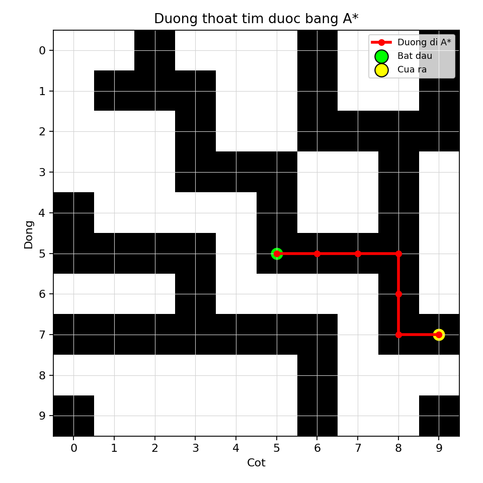

# Câu 1 - Báo cáo thuật toán A*

## Đề bài

Tìm đường thoát từ phòng trung tâm đến rìa lâu đài. Hai ô chỉ nối với nhau nếu có chung cạnh. File đầu vào là `A_in.csv`, file đầu ra theo đề là `A_out.csv`.

Thuật toán chính yêu cầu trong đề là **A*** với hàm:

```text
f(x) = g(x) + h(x)
```

Trong đó:

- `g(x)`: số bước từ điểm bắt đầu đến ô hiện tại.
- `h(x)`: khoảng cách Euclid từ ô hiện tại đến rìa gần nhất.
- `f(x)`: chi phí ưu tiên để chọn ô tiếp theo.

File chương trình:

```text
cau1_astar.py
```

---

## Dữ liệu đầu vào

Dòng đầu của `A_in.csv`:

```text
10,5,5
```

Ý nghĩa:

- `n = 10`: lâu đài là ma trận `10 x 10`.
- Phòng trung tâm bắt đầu tại `(5,5)`.
- Tọa độ trong bài dùng kiểu `0-based`, tức dòng/cột bắt đầu từ 0.

Quy ước ô:

- `1`: có đường hầm, đi được.
- `0`: không có đường hầm, không đi được.

---

## a) Xác định hàm h(x)

### Trả lời: Minh họa giải thích hàm

Trong bài toán tìm kiếm đường đi, mỗi ô đi được trong ma trận được xem là một **trạng thái**. Từ một ô hiện tại, ta có thể sinh ra các trạng thái kế tiếp bằng cách đi sang ô kề cạnh: trên, phải, dưới, trái. Mục tiêu là tìm được một trạng thái nằm ở rìa lâu đài.

Thuật toán A* là thuật toán tìm kiếm có thông tin. Nghĩa là ngoài chi phí đã đi, thuật toán còn dùng thêm một hàm ước lượng để đo xem ô hiện tại còn cách mục tiêu khoảng bao xa.

A* dùng hàm đánh giá:

```text
f(x) = g(x) + h(x)
```

Trong đó:

- `g(x)` là chi phí thật từ phòng trung tâm đến ô `x`.
- `h(x)` là chi phí ước lượng từ ô `x` đến cửa ra gần nhất.
- `f(x)` là tổng chi phí dùng để quyết định ô nào được xét trước.

Với một ô hiện tại:

```text
x = (row, col)
```

ta cần ước lượng khoảng cách từ ô đó đến rìa lâu đài. Vì rìa lâu đài gồm 4 cạnh của ma trận nên khoảng cách Euclid ngắn nhất đến rìa là khoảng cách nhỏ nhất đến 4 cạnh:

```text
h(x) = min(
    row,
    col,
    n - 1 - row,
    n - 1 - col
)
```

Trong code, em viết theo dạng Euclid:

```text
sqrt(row^2)
sqrt(col^2)
sqrt((n - 1 - row)^2)
sqrt((n - 1 - col)^2)
```

Về mặt hình học, rìa gần nhất của một ô trong ma trận luôn nằm theo một trong 4 hướng thẳng: lên trên, sang trái, xuống dưới hoặc sang phải. Vì vậy khoảng cách Euclid đến rìa gần nhất chính là giá trị nhỏ nhất trong 4 khoảng cách trên.

Ví dụ với `n = 10`, ô bắt đầu `(5,5)`:

```text
Đến rìa trên:  sqrt(5^2) = 5
Đến rìa trái:  sqrt(5^2) = 5
Đến rìa dưới:  sqrt((9 - 5)^2) = 4
Đến rìa phải:  sqrt((9 - 5)^2) = 4

h(5,5) = 4
```

Nếu xét ô `(7,9)`:

```text
Đến rìa phải: sqrt((9 - 9)^2) = 0
h(7,9) = 0
```

Vì `h(7,9) = 0`, ô này nằm ngay trên rìa lâu đài và là một cửa ra hợp lệ.

Ý nghĩa của hàm `h(x)` trong A*:

- Giúp thuật toán ưu tiên các ô có vẻ gần cửa ra hơn.
- Kết hợp với `g(x)` để tránh chỉ tham lam chạy về rìa mà bỏ qua chi phí đã đi.
- Với bài toán này, `h(x)` không vượt quá khoảng cách thật đến rìa nếu không có tường, nên là một ước lượng hợp lý.

### Trả lời: Dán code hàm h(x)

```python
def heuristic_to_border(position, n):
    row, col = position
    distances = [
        math.sqrt(row**2),
        math.sqrt(col**2),
        math.sqrt((n - 1 - row) ** 2),
        math.sqrt((n - 1 - col) ** 2),
    ]
    return min(distances)
```

---

## b) Viết chương trình hoàn thiện cho bài toán bằng A*

### Trả lời: Dán code chương trình hoàn thiện

Dưới đây là toàn bộ chương trình hoàn thiện. Có thể copy nguyên khối code này để chạy:

```python
from pathlib import Path
import csv
import heapq
import math

import matplotlib.pyplot as plt


def read_input(file_path):
    with open(file_path, newline="", encoding="utf-8-sig") as f:
        reader = csv.reader(f)
        first_line = next(reader)
        n = int(first_line[0])
        start = (int(first_line[1]), int(first_line[2]))
        maze = [[int(value) for value in row] for row in reader]

    return n, start, maze


def heuristic_to_border(position, n):
    row, col = position
    distances = [
        math.sqrt(row**2),
        math.sqrt(col**2),
        math.sqrt((n - 1 - row) ** 2),
        math.sqrt((n - 1 - col) ** 2),
    ]
    return min(distances)


def is_inside(position, n):
    row, col = position
    return 0 <= row < n and 0 <= col < n


def is_border(position, n):
    row, col = position
    return row == 0 or row == n - 1 or col == 0 or col == n - 1


def get_neighbors(position, n, maze):
    row, col = position
    directions = [(-1, 0), (0, 1), (1, 0), (0, -1)]
    neighbors = []

    for d_row, d_col in directions:
        next_pos = (row + d_row, col + d_col)

        if is_inside(next_pos, n) and maze[next_pos[0]][next_pos[1]] == 1:
            neighbors.append(next_pos)

    return neighbors


def reconstruct_path(parent, goal):
    path = []
    current = goal

    while current is not None:
        path.append(current)
        current = parent[current]

    path.reverse()
    return path


def astar_escape(n, start, maze):
    if not is_inside(start, n) or maze[start[0]][start[1]] != 1:
        return None

    open_set = []
    start_g = 0
    start_h = heuristic_to_border(start, n)
    heapq.heappush(open_set, (start_g + start_h, start_h, start_g, start))

    parent = {start: None}
    g_score = {start: 0}
    visited = set()

    while open_set:
        _, _, current_g, current = heapq.heappop(open_set)

        if current in visited:
            continue

        visited.add(current)

        if is_border(current, n):
            return reconstruct_path(parent, current)

        for neighbor in get_neighbors(current, n, maze):
            tentative_g = current_g + 1

            if neighbor not in g_score or tentative_g < g_score[neighbor]:
                g_score[neighbor] = tentative_g
                parent[neighbor] = current
                h = heuristic_to_border(neighbor, n)
                f = tentative_g + h
                heapq.heappush(open_set, (f, h, tentative_g, neighbor))

    return None


def write_output(file_path, path):
    with open(file_path, "w", newline="", encoding="utf-8-sig") as f:
        writer = csv.writer(f)

        if path is None:
            writer.writerow([-1])
            return

        writer.writerow([len(path)])
        writer.writerows(path)


def save_path_chart(maze, path, output_file):
    n = len(maze)

    plt.figure(figsize=(6, 6))
    plt.imshow(maze, cmap="gray_r")
    plt.xticks(range(n))
    plt.yticks(range(n))
    plt.grid(color="lightgray", linewidth=0.5)

    if path is not None:
        rows = [position[0] for position in path]
        cols = [position[1] for position in path]
        plt.plot(cols, rows, color="red", linewidth=2.5, marker="o", markersize=5, label="Duong di A*")
        plt.scatter(cols[0], rows[0], c="lime", s=140, edgecolors="black", label="Bat dau")
        plt.scatter(cols[-1], rows[-1], c="yellow", s=140, edgecolors="black", label="Cua ra")

    plt.title("Duong thoat tim duoc bang A*")
    plt.xlabel("Cot")
    plt.ylabel("Dong")
    plt.legend(loc="upper right", fontsize=8)
    plt.tight_layout()
    plt.savefig(output_file, dpi=160)
    plt.close()


def main():
    current_dir = Path(__file__).resolve().parent
    input_file = current_dir.parent / "A_in.csv"
    output_file = current_dir / "A_out.csv"
    path_image = current_dir / "cau1_astar_path.png"

    n, start, maze = read_input(input_file)
    path = astar_escape(n, start, maze)
    write_output(output_file, path)
    save_path_chart(maze, path, path_image)

    if path is None:
        print("Khong tim thay duong thoat. A_out.csv ghi -1.")
    else:
        print(f"Tim thay duong thoat bang A*: {len(path)} o.")
        print(f"Da ghi ket qua vao: {output_file}")
        print(f"Da luu bieu do duong di: {path_image}")


if __name__ == "__main__":
    main()

```

### Trả lời: Giải thích chương trình

Chương trình được chia thành các hàm chính sau:

| Hàm | Chức năng |
|---|---|
| `read_input` | Đọc kích thước ma trận, tọa độ bắt đầu và ma trận đường hầm từ `A_in.csv` |
| `heuristic_to_border` | Tính `h(x)`, tức khoảng cách Euclid từ ô hiện tại đến rìa gần nhất |
| `is_inside` | Kiểm tra một tọa độ có nằm trong ma trận hay không |
| `is_border` | Kiểm tra một ô có nằm ở rìa lâu đài hay không |
| `get_neighbors` | Lấy các ô kề cạnh hợp lệ có thể đi được |
| `reconstruct_path` | Truy vết đường đi từ cửa ra về phòng trung tâm thông qua mảng cha |
| `astar_escape` | Thực hiện thuật toán A* để tìm đường thoát |
| `write_output` | Ghi kết quả đường đi ra file `A_out.csv` |
| `save_path_chart` | Vẽ hình minh họa đường đi tìm được |
| `main` | Hàm điều phối toàn bộ chương trình |

A* sử dụng hàng đợi ưu tiên `open_set`. Mỗi phần tử trong `open_set` gồm:

```text
(f, h, g, position)
```

Trong đó:

- `position`: ô đang xét.
- `g`: số bước đã đi từ ô bắt đầu đến ô này.
- `h`: khoảng cách Euclid ước lượng đến rìa gần nhất.
- `f = g + h`: giá trị dùng để ưu tiên.

Ở mỗi vòng lặp, thuật toán lấy ô có `f` nhỏ nhất ra xét trước. Nếu ô đó nằm trên rìa lâu đài thì tìm được cửa ra. Nếu chưa, thuật toán xét các ô kề cạnh hợp lệ và đưa chúng vào `open_set`.

---

## Bảng bước chạy chi tiết của A*

Quy ước:

- `g`: chi phí từ điểm bắt đầu đến ô hiện tại.
- `h`: heuristic đến rìa gần nhất.
- `f = g + h`.
- `Thêm vào open_set` là các ô mới được đưa vào hàng đợi ưu tiên.

| Bước | Ô lấy ra | g | h | f | Thêm vào open_set | Ghi chú |
|---:|---|---:|---:|---:|---|---|
| 1 | (5,5) | 0 | 4 | 4 | (4,5) g=1 h=4 f=5; (5,6) g=1 h=3 f=4 | Tiếp tục |
| 2 | (5,6) | 1 | 3 | 4 | (5,7) g=2 h=2 f=4 | Tiếp tục |
| 3 | (5,7) | 2 | 2 | 4 | (5,8) g=3 h=1 f=4 | Tiếp tục |
| 4 | (5,8) | 3 | 1 | 4 | (4,8) g=4 h=1 f=5; (6,8) g=4 h=1 f=5 | Tiếp tục |
| 5 | (4,8) | 4 | 1 | 5 | (3,8) g=5 h=1 f=6 | Tiếp tục |
| 6 | (6,8) | 4 | 1 | 5 | (7,8) g=5 h=1 f=6 | Tiếp tục |
| 7 | (4,5) | 1 | 4 | 5 | (3,5) g=2 h=3 f=5 | Tiếp tục |
| 8 | (3,5) | 2 | 3 | 5 | (3,4) g=3 h=3 f=6 | Tiếp tục |
| 9 | (3,8) | 5 | 1 | 6 | (2,8) g=6 h=1 f=7 | Tiếp tục |
| 10 | (7,8) | 5 | 1 | 6 | (7,9) g=6 h=0 f=6 | Tiếp tục |
| 11 | (7,9) | 6 | 0 | 6 | Không thêm | Gặp cửa ra |

Nhận xét:

- A* tìm thấy cửa ra ở bước xét thứ 11.
- Đường đi có 7 ô.
- Ô cuối `(7,9)` nằm ở cột 9, tức rìa phải của ma trận `10 x 10`.

---

## Biểu đồ đường đi A*



Ý nghĩa:

- Ô màu đen là ô đi được, tương ứng giá trị `1`.
- Ô màu trắng là tường/không đi được, tương ứng giá trị `0`.
- Đường màu đỏ là đường đi A*.
- Điểm màu xanh là phòng trung tâm.
- Điểm màu vàng là cửa ra.

---

## c) Thực thi chương trình với A_in.csv

Lệnh chạy:

```powershell
python "2025/De2/BFS_DFS_Astar_Cau1/01_AStar/cau1_astar.py"
```

Kết quả in ra:

```text
Tim thay duong thoat bang A*: 7 o.
```

### Trả lời: Dán kết quả trong A_out.csv

```text
7
5,5
5,6
5,7
5,8
6,8
7,8
7,9
```

Kết luận: A* tìm được đường thoát hợp lệ gồm 7 ô từ `(5,5)` đến cửa ra `(7,9)`.

