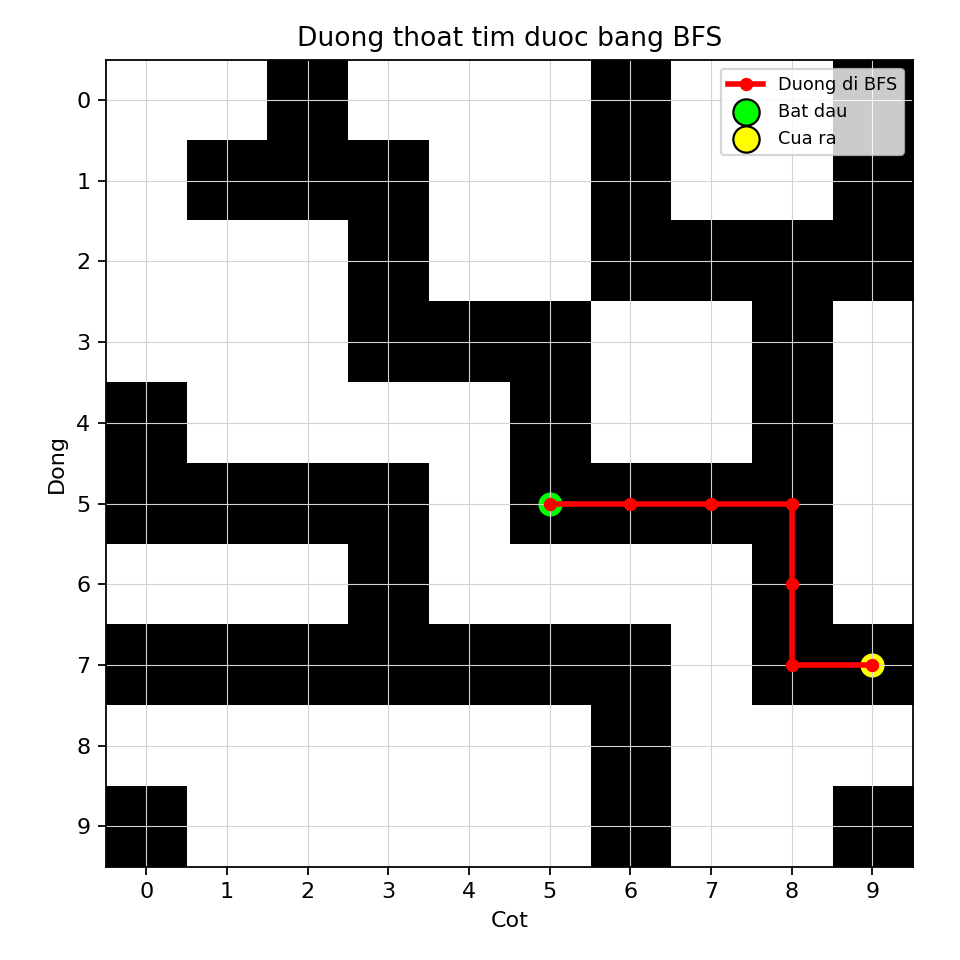

# Câu 1 - Báo cáo thuật toán BFS

## Đề bài

Một lâu đài cổ có hệ thống đường hầm bí mật, với một cửa vào duy nhất tại phòng trung tâm và nhiều cửa ra ở rìa lâu đài. Hai ô hầm chỉ nối với nhau nếu có chung cạnh.

Trong báo cáo này, em trình bày cách giải bài toán bằng thuật toán **BFS** để so sánh với A*.

File chương trình:

```text
cau1_bfs.py
```

File kết quả:

```text
BFS_out.csv
```

---

## Dữ liệu đầu vào

File `A_in.csv`:

```text
10,5,5
0,0,1,0,0,0,1,0,0,1
0,1,1,1,0,0,1,0,0,1
0,0,0,1,0,0,1,1,1,1
0,0,0,1,1,1,0,0,1,0
1,0,0,0,0,1,0,0,1,0
1,1,1,1,0,1,1,1,1,0
0,0,0,1,0,0,0,0,1,0
1,1,1,1,1,1,1,0,1,1
0,0,0,0,0,0,1,0,0,0
1,0,0,0,0,0,1,0,0,1
```

Ý nghĩa:

- `n = 10`: ma trận kích thước `10 x 10`.
- Điểm bắt đầu là `(5,5)`.
- Tọa độ dùng kiểu `0-based`.
- Ô `1` là ô đi được.
- Ô `0` là ô không đi được.

---

## a) Xác định nguyên lý duyệt của BFS

### Trả lời: Minh họa giải thích thuật toán BFS

BFS là viết tắt của **Breadth First Search**, nghĩa là tìm kiếm theo chiều rộng.

Trong bài toán lâu đài, mỗi ô có giá trị `1` được xem là một **trạng thái có thể đi qua**. Từ một ô, thuật toán chỉ được đi sang các ô có chung cạnh, tức là tối đa 4 hướng:

```text
Trên, phải, dưới, trái
```

Mục tiêu của BFS là tìm một ô nằm ở rìa ma trận. BFS không dùng hàm heuristic. Thay vào đó, BFS duyệt theo từng lớp khoảng cách tính từ điểm bắt đầu:

```text
Lớp 0: ô bắt đầu
Lớp 1: các ô cách điểm bắt đầu 1 bước
Lớp 2: các ô cách điểm bắt đầu 2 bước
...
```

Với `A_in.csv`, điểm bắt đầu là `(5,5)`. Các ô kề hợp lệ đầu tiên là:

```text
(4,5) và (5,6)
```

Hai ô này thuộc lớp 1 vì chỉ cần đi 1 bước từ `(5,5)`.

BFS sử dụng cấu trúc dữ liệu **queue**, tức hàng đợi.

Nguyên tắc của queue:

```text
Vào trước, ra trước
```

Hay còn gọi là:

```text
FIFO = First In, First Out
```

Nhờ queue, ô nào được phát hiện trước sẽ được xét trước. Vì vậy BFS sẽ xét hết các ô cách điểm bắt đầu 1 bước, rồi mới đến các ô cách 2 bước, rồi 3 bước, v.v.

Trong bài toán này, mỗi bước đi sang ô kề cạnh đều có chi phí bằng nhau là `1`. Do đó BFS có tính chất quan trọng:

```text
Nếu tồn tại đường thoát, BFS tìm được đường thoát ngắn nhất theo số bước.
```

BFS cần thêm mảng/tập `visited` để tránh đi vòng lặp. Ví dụ nếu từ ô A đi sang ô B, rồi từ B lại quay về A, chương trình có thể lặp vô hạn nếu không đánh dấu ô đã thăm.

Ngoài ra, BFS dùng `parent` để lưu đường đi. Khi gặp cửa ra, ta truy ngược từ cửa ra về phòng trung tâm nhờ `parent`, sau đó đảo ngược lại để thu được đường đi đúng thứ tự.

### Trả lời: Dán code cấu trúc queue của BFS

```python
queue = deque([start])
parent = {start: None}
visited = {start}
```

Giải thích:

- `queue`: lưu các ô chờ được xét.
- `visited`: lưu các ô đã được thăm để tránh lặp lại.
- `parent`: lưu ô cha của mỗi ô để truy vết đường đi sau khi tìm thấy cửa ra.

---

## b) Viết chương trình hoàn thiện cho bài toán bằng BFS

### Trả lời: Dán code chương trình hoàn thiện

Dưới đây là toàn bộ chương trình hoàn thiện. Có thể copy nguyên khối code này để chạy:

```python
from pathlib import Path
import csv
from collections import deque

import matplotlib.pyplot as plt


def read_input(file_path):
    with open(file_path, newline="", encoding="utf-8-sig") as f:
        reader = csv.reader(f)
        first_line = next(reader)
        n = int(first_line[0])
        start = (int(first_line[1]), int(first_line[2]))
        maze = [[int(value) for value in row] for row in reader]

    return n, start, maze


def is_inside(position, n):
    row, col = position
    return 0 <= row < n and 0 <= col < n


def is_border(position, n):
    row, col = position
    return row == 0 or row == n - 1 or col == 0 or col == n - 1


def get_neighbors(position, n, maze):
    row, col = position
    directions = [(-1, 0), (0, 1), (1, 0), (0, -1)]
    neighbors = []

    for d_row, d_col in directions:
        next_pos = (row + d_row, col + d_col)

        if is_inside(next_pos, n) and maze[next_pos[0]][next_pos[1]] == 1:
            neighbors.append(next_pos)

    return neighbors


def reconstruct_path(parent, goal):
    path = []
    current = goal

    while current is not None:
        path.append(current)
        current = parent[current]

    path.reverse()
    return path


def bfs_escape(n, start, maze):
    if not is_inside(start, n) or maze[start[0]][start[1]] != 1:
        return None

    queue = deque([start])
    parent = {start: None}
    visited = {start}

    while queue:
        current = queue.popleft()

        if is_border(current, n):
            return reconstruct_path(parent, current)

        for neighbor in get_neighbors(current, n, maze):
            if neighbor not in visited:
                visited.add(neighbor)
                parent[neighbor] = current
                queue.append(neighbor)

    return None


def write_output(file_path, path):
    with open(file_path, "w", newline="", encoding="utf-8-sig") as f:
        writer = csv.writer(f)

        if path is None:
            writer.writerow([-1])
            return

        writer.writerow([len(path)])
        writer.writerows(path)


def save_path_chart(maze, path, output_file):
    n = len(maze)

    plt.figure(figsize=(6, 6))
    plt.imshow(maze, cmap="gray_r")
    plt.xticks(range(n))
    plt.yticks(range(n))
    plt.grid(color="lightgray", linewidth=0.5)

    if path is not None:
        rows = [position[0] for position in path]
        cols = [position[1] for position in path]
        plt.plot(cols, rows, color="red", linewidth=2.5, marker="o", markersize=5, label="Duong di BFS")
        plt.scatter(cols[0], rows[0], c="lime", s=140, edgecolors="black", label="Bat dau")
        plt.scatter(cols[-1], rows[-1], c="yellow", s=140, edgecolors="black", label="Cua ra")

    plt.title("Duong thoat tim duoc bang BFS")
    plt.xlabel("Cot")
    plt.ylabel("Dong")
    plt.legend(loc="upper right", fontsize=8)
    plt.tight_layout()
    plt.savefig(output_file, dpi=160)
    plt.close()


def main():
    current_dir = Path(__file__).resolve().parent
    input_file = current_dir.parent / "A_in.csv"
    output_file = current_dir / "BFS_out.csv"
    path_image = current_dir / "cau1_bfs_path.png"

    n, start, maze = read_input(input_file)
    path = bfs_escape(n, start, maze)
    write_output(output_file, path)
    save_path_chart(maze, path, path_image)

    if path is None:
        print("BFS khong tim thay duong thoat.")
    else:
        print(f"BFS tim thay duong thoat: {len(path)} o.")
        print(f"Da ghi ket qua vao: {output_file}")
        print(f"Da luu bieu do duong di: {path_image}")


if __name__ == "__main__":
    main()

```

### Trả lời: Giải thích chương trình

Chương trình được chia thành các hàm chính sau:

| Hàm | Chức năng |
|---|---|
| `read_input` | Đọc dữ liệu từ `A_in.csv`, gồm `n`, điểm bắt đầu và ma trận lâu đài |
| `is_inside` | Kiểm tra tọa độ có nằm trong ma trận hay không |
| `is_border` | Kiểm tra ô hiện tại có phải cửa ra ở rìa lâu đài hay không |
| `get_neighbors` | Lấy các ô kề cạnh đi được theo 4 hướng |
| `reconstruct_path` | Truy vết đường đi sau khi tìm thấy cửa ra |
| `bfs_escape` | Thực hiện thuật toán BFS bằng queue |
| `write_output` | Ghi kết quả đường đi vào `BFS_out.csv` |
| `save_path_chart` | Vẽ biểu đồ đường đi BFS |
| `main` | Gọi các hàm theo thứ tự đọc dữ liệu, tìm đường, ghi file và vẽ hình |

Chương trình BFS hoạt động như sau:

1. Đọc kích thước ma trận, điểm bắt đầu và mê cung từ `A_in.csv`.
2. Đưa điểm bắt đầu `(5,5)` vào queue.
3. Lấy lần lượt từng ô ở đầu queue ra xét.
4. Nếu ô đang xét nằm ở rìa lâu đài thì tìm thấy đường thoát.
5. Nếu chưa đến rìa, chương trình xét 4 ô kề cạnh: trên, phải, dưới, trái.
6. Chỉ những ô nằm trong ma trận và có giá trị `1` mới được đi qua.
7. Mỗi ô mới được lưu vào `parent` để sau đó truy ngược lại đường đi.
8. Nếu queue rỗng mà chưa gặp rìa thì không có đường thoát.

---

## Bảng queue chi tiết khi chạy BFS

| Bước | Ô lấy ra | Ô thêm vào queue | Queue sau bước | Ghi chú |
|---:|---|---|---|---|
| 1 | (5,5) | (4,5), (5,6) | (4,5), (5,6) | Tiếp tục |
| 2 | (4,5) | (3,5) | (5,6), (3,5) | Tiếp tục |
| 3 | (5,6) | (5,7) | (3,5), (5,7) | Tiếp tục |
| 4 | (3,5) | (3,4) | (5,7), (3,4) | Tiếp tục |
| 5 | (5,7) | (5,8) | (3,4), (5,8) | Tiếp tục |
| 6 | (3,4) | (3,3) | (5,8), (3,3) | Tiếp tục |
| 7 | (5,8) | (4,8), (6,8) | (3,3), (4,8), (6,8) | Tiếp tục |
| 8 | (3,3) | (2,3) | (4,8), (6,8), (2,3) | Tiếp tục |
| 9 | (4,8) | (3,8) | (6,8), (2,3), (3,8) | Tiếp tục |
| 10 | (6,8) | (7,8) | (2,3), (3,8), (7,8) | Tiếp tục |
| 11 | (2,3) | (1,3) | (3,8), (7,8), (1,3) | Tiếp tục |
| 12 | (3,8) | (2,8) | (7,8), (1,3), (2,8) | Tiếp tục |
| 13 | (7,8) | (7,9) | (1,3), (2,8), (7,9) | Tiếp tục |
| 14 | (1,3) | (1,2) | (2,8), (7,9), (1,2) | Tiếp tục |
| 15 | (2,8) | (2,9), (2,7) | (7,9), (1,2), (2,9), (2,7) | Tiếp tục |
| 16 | (7,9) | Không thêm | (1,2), (2,9), (2,7) | Gặp cửa ra |

Nhận xét:

- BFS gặp cửa ra tại ô `(7,9)`.
- Vì cột `9` là rìa phải của ma trận `10 x 10`, đây là cửa ra hợp lệ.
- Đường đi gồm 7 ô.

---

## Biểu đồ đường đi BFS



Ý nghĩa:

- Ô màu đen là ô đi được, tương ứng giá trị `1`.
- Ô màu trắng là tường hoặc không đi được, tương ứng giá trị `0`.
- Đường màu đỏ là đường đi BFS.
- Điểm màu xanh là phòng trung tâm.
- Điểm màu vàng là cửa ra.

---

## c) Thực thi chương trình với tệp A_in.csv

### Trả lời: Dán code thực thi thành công

```python
def main():
    current_dir = Path(__file__).resolve().parent
    input_file = current_dir.parent / "A_in.csv"
    output_file = current_dir / "BFS_out.csv"
    path_image = current_dir / "cau1_bfs_path.png"

    n, start, maze = read_input(input_file)
    path = bfs_escape(n, start, maze)
    write_output(output_file, path)
    save_path_chart(maze, path, path_image)
```

Lệnh chạy:

```powershell
python "2025/De2/BFS_DFS_Astar_Cau1/02_BFS/cau1_bfs.py"
```

Kết quả in ra:

```text
BFS tim thay duong thoat: 7 o.
```

### Trả lời: Dán kết quả trong BFS_out.csv vào bên dưới

```text
7
5,5
5,6
5,7
5,8
6,8
7,8
7,9
```

Kết luận: BFS tìm được đường thoát hợp lệ gồm 7 ô từ phòng trung tâm `(5,5)` đến cửa ra `(7,9)`.

