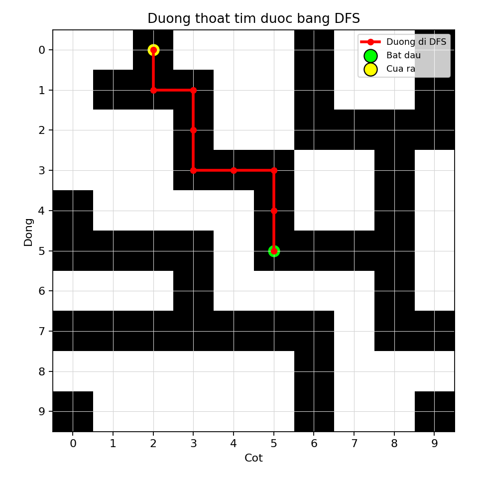

# Câu 1 - Báo cáo thuật toán DFS

## Đề bài

Một lâu đài cổ có hệ thống đường hầm bí mật, với một cửa vào duy nhất tại phòng trung tâm và nhiều cửa ra ở rìa lâu đài. Hai ô hầm chỉ nối với nhau nếu có chung cạnh.

Trong báo cáo này, em trình bày cách giải bài toán bằng thuật toán **DFS** để so sánh với A* và BFS.

File chương trình:

```text
cau1_dfs.py
```

File kết quả:

```text
DFS_out.csv
```

---

## Dữ liệu đầu vào

File `A_in.csv`:

```text
10,5,5
0,0,1,0,0,0,1,0,0,1
0,1,1,1,0,0,1,0,0,1
0,0,0,1,0,0,1,1,1,1
0,0,0,1,1,1,0,0,1,0
1,0,0,0,0,1,0,0,1,0
1,1,1,1,0,1,1,1,1,0
0,0,0,1,0,0,0,0,1,0
1,1,1,1,1,1,1,0,1,1
0,0,0,0,0,0,1,0,0,0
1,0,0,0,0,0,1,0,0,1
```

Ý nghĩa:

- `n = 10`: ma trận kích thước `10 x 10`.
- Điểm bắt đầu là `(5,5)`.
- Tọa độ dùng kiểu `0-based`.
- Ô `1` là ô đi được.
- Ô `0` là ô không đi được.

---

## a) Xác định nguyên lý duyệt của DFS

### Trả lời: Minh họa giải thích thuật toán DFS

DFS là viết tắt của **Depth First Search**, nghĩa là tìm kiếm theo chiều sâu.

Trong bài toán lâu đài, mỗi ô có giá trị `1` là một trạng thái có thể đi qua. Từ mỗi ô, DFS xét các ô kề cạnh hợp lệ theo 4 hướng:

```text
Trên, phải, dưới, trái
```

DFS ưu tiên đi sâu theo một nhánh trước. Nếu nhánh đó không đi tiếp được thì thuật toán quay lui và thử nhánh khác.

Ví dụ từ điểm bắt đầu `(5,5)`, DFS có thể đi theo nhánh:

```text
(5,5) -> (4,5) -> (3,5) -> (3,4) -> ...
```

Thuật toán cứ tiếp tục đi sâu cho đến khi gặp cửa ra hoặc không còn ô hợp lệ để đi tiếp.

DFS sử dụng cấu trúc dữ liệu **stack**, tức ngăn xếp.

Nguyên tắc của stack:

```text
Vào sau, ra trước
```

Hay còn gọi là:

```text
LIFO = Last In, First Out
```

Nhờ stack, ô nào được thêm vào sau sẽ được xét trước. Đây là lý do DFS thường đi rất sâu theo một nhánh trước khi quay lại xét nhánh khác.

DFS cần `visited` để tránh lặp vô hạn. Trong mê cung, có thể có các vòng đường hầm. Nếu không đánh dấu ô đã thăm, DFS có thể đi qua đi lại giữa các ô đã xét.

DFS cũng dùng `parent` để lưu lại ô cha. Khi gặp một ô ở rìa lâu đài, ta dùng `parent` để truy vết đường đi từ cửa ra về phòng trung tâm.

Tính chất quan trọng:

- DFS tìm được một đường thoát nếu tồn tại đường và thứ tự duyệt dẫn đến cửa ra.
- DFS thường dùng ít bộ nhớ hơn BFS trong nhiều trường hợp.
- DFS **không đảm bảo đường đi ngắn nhất**, vì thuật toán có thể đi sâu vào một nhánh dài trước khi xét nhánh ngắn hơn.

Trong dữ liệu này, DFS tìm được cửa ra `(0,2)` với đường đi gồm 9 ô, dài hơn đường của A* và BFS.

### Trả lời: Dán code cấu trúc stack của DFS

```python
stack = [start]
parent = {start: None}
visited = {start}
```

Giải thích:

- `stack`: lưu các ô chờ được xét.
- `visited`: lưu các ô đã được thăm để tránh lặp lại.
- `parent`: lưu ô cha của mỗi ô để truy vết đường đi.

---

## b) Viết chương trình hoàn thiện cho bài toán bằng DFS

### Trả lời: Dán code chương trình hoàn thiện

Dưới đây là toàn bộ chương trình hoàn thiện. Có thể copy nguyên khối code này để chạy:

```python
from pathlib import Path
import csv

import matplotlib.pyplot as plt


def read_input(file_path):
    with open(file_path, newline="", encoding="utf-8-sig") as f:
        reader = csv.reader(f)
        first_line = next(reader)
        n = int(first_line[0])
        start = (int(first_line[1]), int(first_line[2]))
        maze = [[int(value) for value in row] for row in reader]

    return n, start, maze


def is_inside(position, n):
    row, col = position
    return 0 <= row < n and 0 <= col < n


def is_border(position, n):
    row, col = position
    return row == 0 or row == n - 1 or col == 0 or col == n - 1


def get_neighbors(position, n, maze):
    row, col = position
    directions = [(-1, 0), (0, 1), (1, 0), (0, -1)]
    neighbors = []

    for d_row, d_col in directions:
        next_pos = (row + d_row, col + d_col)

        if is_inside(next_pos, n) and maze[next_pos[0]][next_pos[1]] == 1:
            neighbors.append(next_pos)

    return neighbors


def reconstruct_path(parent, goal):
    path = []
    current = goal

    while current is not None:
        path.append(current)
        current = parent[current]

    path.reverse()
    return path


def dfs_escape(n, start, maze):
    if not is_inside(start, n) or maze[start[0]][start[1]] != 1:
        return None

    stack = [start]
    parent = {start: None}
    visited = {start}

    while stack:
        current = stack.pop()

        if is_border(current, n):
            return reconstruct_path(parent, current)

        for neighbor in reversed(get_neighbors(current, n, maze)):
            if neighbor not in visited:
                visited.add(neighbor)
                parent[neighbor] = current
                stack.append(neighbor)

    return None


def write_output(file_path, path):
    with open(file_path, "w", newline="", encoding="utf-8-sig") as f:
        writer = csv.writer(f)

        if path is None:
            writer.writerow([-1])
            return

        writer.writerow([len(path)])
        writer.writerows(path)


def save_path_chart(maze, path, output_file):
    n = len(maze)

    plt.figure(figsize=(6, 6))
    plt.imshow(maze, cmap="gray_r")
    plt.xticks(range(n))
    plt.yticks(range(n))
    plt.grid(color="lightgray", linewidth=0.5)

    if path is not None:
        rows = [position[0] for position in path]
        cols = [position[1] for position in path]
        plt.plot(cols, rows, color="red", linewidth=2.5, marker="o", markersize=5, label="Duong di DFS")
        plt.scatter(cols[0], rows[0], c="lime", s=140, edgecolors="black", label="Bat dau")
        plt.scatter(cols[-1], rows[-1], c="yellow", s=140, edgecolors="black", label="Cua ra")

    plt.title("Duong thoat tim duoc bang DFS")
    plt.xlabel("Cot")
    plt.ylabel("Dong")
    plt.legend(loc="upper right", fontsize=8)
    plt.tight_layout()
    plt.savefig(output_file, dpi=160)
    plt.close()


def main():
    current_dir = Path(__file__).resolve().parent
    input_file = current_dir.parent / "A_in.csv"
    output_file = current_dir / "DFS_out.csv"
    path_image = current_dir / "cau1_dfs_path.png"

    n, start, maze = read_input(input_file)
    path = dfs_escape(n, start, maze)
    write_output(output_file, path)
    save_path_chart(maze, path, path_image)

    if path is None:
        print("DFS khong tim thay duong thoat.")
    else:
        print(f"DFS tim thay duong thoat: {len(path)} o.")
        print(f"Da ghi ket qua vao: {output_file}")
        print(f"Da luu bieu do duong di: {path_image}")


if __name__ == "__main__":
    main()

```

### Trả lời: Giải thích chương trình

Chương trình được chia thành các hàm chính sau:

| Hàm | Chức năng |
|---|---|
| `read_input` | Đọc dữ liệu đầu vào từ `A_in.csv` |
| `is_inside` | Kiểm tra một ô có nằm trong phạm vi ma trận hay không |
| `is_border` | Kiểm tra một ô có nằm trên rìa lâu đài hay không |
| `get_neighbors` | Sinh các ô kề cạnh hợp lệ |
| `reconstruct_path` | Khôi phục đường đi bằng cách lần theo ô cha |
| `dfs_escape` | Thực hiện thuật toán DFS bằng stack |
| `write_output` | Ghi kết quả đường đi vào `DFS_out.csv` |
| `save_path_chart` | Vẽ biểu đồ đường đi DFS |
| `main` | Điều phối toàn bộ quá trình chạy chương trình |

Chương trình DFS hoạt động như sau:

1. Đọc kích thước ma trận, điểm bắt đầu và mê cung từ `A_in.csv`.
2. Đưa điểm bắt đầu `(5,5)` vào stack.
3. Lấy ô trên đỉnh stack ra xét.
4. Nếu ô đang xét nằm ở rìa lâu đài thì tìm thấy đường thoát.
5. Nếu chưa đến rìa, chương trình xét 4 ô kề cạnh: trên, phải, dưới, trái.
6. Chỉ những ô nằm trong ma trận và có giá trị `1` mới được đi qua.
7. Mỗi ô mới được lưu vào `parent` để truy ngược lại đường đi.
8. DFS ưu tiên đi sâu theo nhánh mới nhất trong stack.
9. Nếu stack rỗng mà chưa gặp rìa thì không có đường thoát.

---

## Bảng stack chi tiết khi chạy DFS

Quy ước:

- Phần tử cuối cùng trong stack là phần tử sẽ được lấy ra ở bước tiếp theo.
- DFS dùng `pop()` nên ô được thêm sau sẽ được xét trước.

| Bước | Ô lấy ra | Ô thêm vào stack | Stack sau bước | Ghi chú |
|---:|---|---|---|---|
| 1 | (5,5) | (5,6), (4,5) | (5,6), (4,5) | Tiếp tục |
| 2 | (4,5) | (3,5) | (5,6), (3,5) | Tiếp tục |
| 3 | (3,5) | (3,4) | (5,6), (3,4) | Tiếp tục |
| 4 | (3,4) | (3,3) | (5,6), (3,3) | Tiếp tục |
| 5 | (3,3) | (2,3) | (5,6), (2,3) | Tiếp tục |
| 6 | (2,3) | (1,3) | (5,6), (1,3) | Tiếp tục |
| 7 | (1,3) | (1,2) | (5,6), (1,2) | Tiếp tục |
| 8 | (1,2) | (1,1), (0,2) | (5,6), (1,1), (0,2) | Tiếp tục |
| 9 | (0,2) | Không thêm | (5,6), (1,1) | Gặp cửa ra |

Nhận xét:

- DFS gặp cửa ra tại ô `(0,2)`.
- Vì dòng `0` là rìa trên của ma trận, đây là cửa ra hợp lệ.
- Đường đi gồm 9 ô.
- DFS tìm được đường thoát nhưng không phải đường ngắn nhất.

---

## Biểu đồ đường đi DFS



Ý nghĩa:

- Ô màu đen là ô đi được, tương ứng giá trị `1`.
- Ô màu trắng là tường hoặc không đi được, tương ứng giá trị `0`.
- Đường màu đỏ là đường đi DFS.
- Điểm màu xanh là phòng trung tâm.
- Điểm màu vàng là cửa ra.

---

## c) Thực thi chương trình với tệp A_in.csv

### Trả lời: Dán code thực thi thành công

```python
def main():
    current_dir = Path(__file__).resolve().parent
    input_file = current_dir.parent / "A_in.csv"
    output_file = current_dir / "DFS_out.csv"
    path_image = current_dir / "cau1_dfs_path.png"

    n, start, maze = read_input(input_file)
    path = dfs_escape(n, start, maze)
    write_output(output_file, path)
    save_path_chart(maze, path, path_image)
```

Lệnh chạy:

```powershell
python "2025/De2/BFS_DFS_Astar_Cau1/03_DFS/cau1_dfs.py"
```

Kết quả in ra:

```text
DFS tim thay duong thoat: 9 o.
```

### Trả lời: Dán kết quả trong DFS_out.csv vào bên dưới

```text
9
5,5
4,5
3,5
3,4
3,3
2,3
1,3
1,2
0,2
```

Kết luận: DFS tìm được đường thoát hợp lệ gồm 9 ô từ phòng trung tâm `(5,5)` đến cửa ra `(0,2)`.

