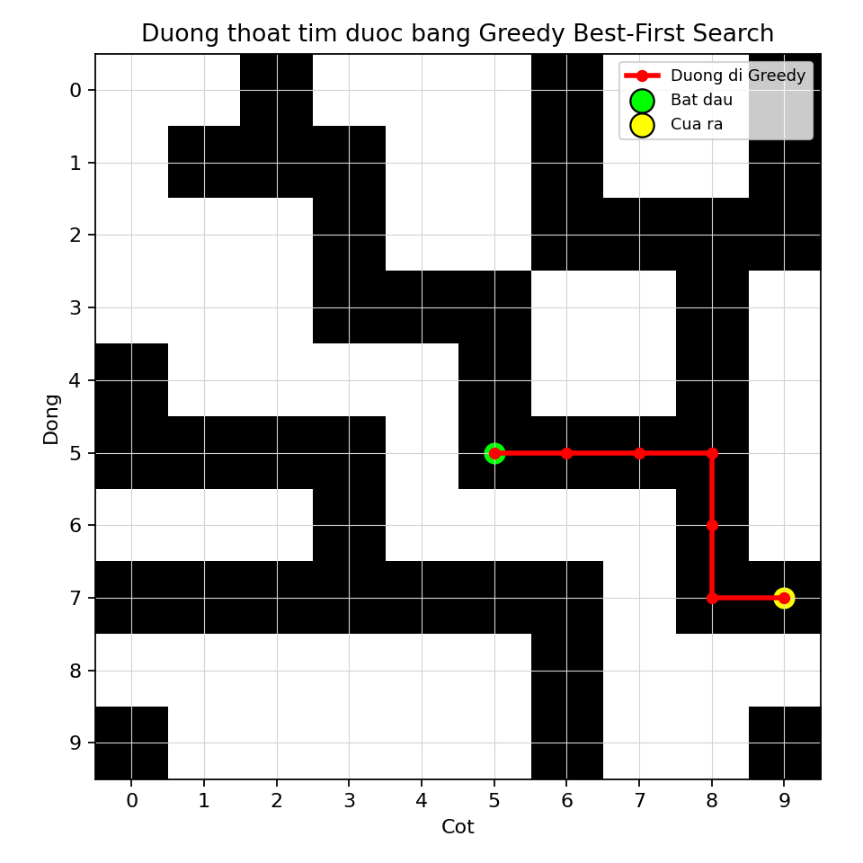

# Câu 1 - Báo cáo thuật toán Greedy Best-First Search

## Đề bài

Một lâu đài cổ có hệ thống đường hầm bí mật, với một cửa vào duy nhất tại phòng trung tâm và nhiều cửa ra ở rìa lâu đài. Hai ô hầm chỉ nối với nhau nếu có chung cạnh.

Trong báo cáo này, em trình bày cách giải bài toán bằng thuật toán:

```text
Greedy Best-First Search
```

File chương trình:

```text
cau1_greedy_best_first.py
```

File kết quả:

```text
Greedy_out.csv
```

---

## Dữ liệu đầu vào

File `A_in.csv`:

```text
10,5,5
```

Ý nghĩa:

- `n = 10`: ma trận kích thước `10 x 10`.
- Điểm bắt đầu là `(5,5)`.
- Tọa độ dùng kiểu `0-based`.
- Ô `1` là ô đi được.
- Ô `0` là ô không đi được.

---

## a) Xác định hàm h(x)

### Trả lời: Minh họa giải thích hàm

Greedy Best-First Search là thuật toán tìm kiếm có thông tin. Thuật toán dùng một hàm heuristic để ước lượng ô nào có vẻ gần mục tiêu nhất.

Trong bài toán lâu đài, mục tiêu là đi đến một ô nằm ở rìa ma trận. Vì vậy ta chọn heuristic là khoảng cách từ ô hiện tại đến rìa gần nhất.

Greedy Best-First Search chọn ô tiếp theo chỉ dựa vào heuristic:

```text
h(x)
```

Điểm khác biệt quan trọng:

- A* dùng `f(x) = g(x) + h(x)`.
- Greedy chỉ dùng `h(x)`.

Nghĩa là Greedy không quan tâm đã đi bao nhiêu bước, mà chỉ quan tâm ô nào nhìn có vẻ gần cửa ra nhất.

Trong bài này, `h(x)` là khoảng cách Euclid từ ô hiện tại đến rìa lâu đài gần nhất.

Với ô:

```text
x = (row, col)
```

và ma trận kích thước `n x n`, khoảng cách đến 4 rìa là:

```text
Rìa trên  = sqrt(row^2)
Rìa trái  = sqrt(col^2)
Rìa dưới  = sqrt((n - 1 - row)^2)
Rìa phải  = sqrt((n - 1 - col)^2)
```

Do cần đến rìa gần nhất:

```text
h(x) = min(khoảng cách đến 4 rìa)
```

Ví dụ với `n = 10`, ô `(5,5)`:

```text
h(5,5) = min(5, 5, 4, 4) = 4
```

Nếu xét hai ô kề đầu tiên của `(5,5)`:

```text
h(4,5) = min(4, 5, 5, 4) = 4
h(5,6) = min(5, 6, 4, 3) = 3
```

Greedy sẽ ưu tiên `(5,6)` trước vì:

```text
h(5,6) = 3 < h(4,5) = 4
```

Ý nghĩa của `h(x)` trong Greedy:

- Giúp thuật toán nhanh chóng hướng về rìa gần nhất.
- Làm số bước xét có thể ít hơn BFS/UCS trong một số trường hợp.
- Tuy nhiên, nếu hướng gần rìa bị tường chặn, Greedy có thể đi vòng hoặc chọn đường không tối ưu.

Vì vậy Greedy là thuật toán nhanh và trực quan, nhưng không đảm bảo tìm đường ngắn nhất trong mọi mê cung.

### Trả lời: Dán code hàm h(x)

```python
def heuristic_to_border(position, n):
    row, col = position
    distances = [
        math.sqrt(row**2),
        math.sqrt(col**2),
        math.sqrt((n - 1 - row) ** 2),
        math.sqrt((n - 1 - col) ** 2),
    ]
    return min(distances)
```

---

## b) Viết chương trình hoàn thiện cho bài toán bằng Greedy Best-First Search

### Trả lời: Ý tưởng thuật toán

Greedy Best-First Search dùng hàng đợi ưu tiên. Khác với A*, thuật toán này **chỉ ưu tiên theo heuristic**:

```text
priority = h(x)
```

Thuật toán không cộng thêm chi phí đã đi `g(x)`.

Vì vậy:

- Greedy thường đi nhanh về phía rìa gần nhất.
- Greedy có thể tìm đường nhanh.
- Nhưng Greedy không đảm bảo đường đi ngắn nhất trong mọi trường hợp.

### Trả lời: Dán code chương trình hoàn thiện

Dưới đây là toàn bộ chương trình hoàn thiện. Có thể copy nguyên khối code này để chạy:

```python
from pathlib import Path
import csv
import heapq
import math

import matplotlib.pyplot as plt


def read_input(file_path):
    with open(file_path, newline="", encoding="utf-8-sig") as f:
        reader = csv.reader(f)
        first_line = next(reader)
        n = int(first_line[0])
        start = (int(first_line[1]), int(first_line[2]))
        maze = [[int(value) for value in row] for row in reader]

    return n, start, maze


def heuristic_to_border(position, n):
    row, col = position
    distances = [
        math.sqrt(row**2),
        math.sqrt(col**2),
        math.sqrt((n - 1 - row) ** 2),
        math.sqrt((n - 1 - col) ** 2),
    ]
    return min(distances)


def is_inside(position, n):
    row, col = position
    return 0 <= row < n and 0 <= col < n


def is_border(position, n):
    row, col = position
    return row == 0 or row == n - 1 or col == 0 or col == n - 1


def get_neighbors(position, n, maze):
    row, col = position
    directions = [(-1, 0), (0, 1), (1, 0), (0, -1)]
    neighbors = []

    for d_row, d_col in directions:
        next_pos = (row + d_row, col + d_col)

        if is_inside(next_pos, n) and maze[next_pos[0]][next_pos[1]] == 1:
            neighbors.append(next_pos)

    return neighbors


def reconstruct_path(parent, goal):
    path = []
    current = goal

    while current is not None:
        path.append(current)
        current = parent[current]

    path.reverse()
    return path


def greedy_escape(n, start, maze):
    if not is_inside(start, n) or maze[start[0]][start[1]] != 1:
        return None

    frontier = []
    start_h = heuristic_to_border(start, n)
    heapq.heappush(frontier, (start_h, 0, start))

    parent = {start: None}
    visited = set()
    order = 0

    while frontier:
        _, _, current = heapq.heappop(frontier)

        if current in visited:
            continue

        visited.add(current)

        if is_border(current, n):
            return reconstruct_path(parent, current)

        for neighbor in get_neighbors(current, n, maze):
            if neighbor not in visited and neighbor not in parent:
                parent[neighbor] = current
                order += 1
                h = heuristic_to_border(neighbor, n)
                heapq.heappush(frontier, (h, order, neighbor))

    return None


def write_output(file_path, path):
    with open(file_path, "w", newline="", encoding="utf-8-sig") as f:
        writer = csv.writer(f)

        if path is None:
            writer.writerow([-1])
            return

        writer.writerow([len(path)])
        writer.writerows(path)


def save_path_chart(maze, path, output_file):
    n = len(maze)

    plt.figure(figsize=(6, 6))
    plt.imshow(maze, cmap="gray_r")
    plt.xticks(range(n))
    plt.yticks(range(n))
    plt.grid(color="lightgray", linewidth=0.5)

    if path is not None:
        rows = [position[0] for position in path]
        cols = [position[1] for position in path]
        plt.plot(cols, rows, color="red", linewidth=2.5, marker="o", markersize=5, label="Duong di Greedy")
        plt.scatter(cols[0], rows[0], c="lime", s=140, edgecolors="black", label="Bat dau")
        plt.scatter(cols[-1], rows[-1], c="yellow", s=140, edgecolors="black", label="Cua ra")

    plt.title("Duong thoat tim duoc bang Greedy Best-First Search")
    plt.xlabel("Cot")
    plt.ylabel("Dong")
    plt.legend(loc="upper right", fontsize=8)
    plt.tight_layout()
    plt.savefig(output_file, dpi=160)
    plt.close()


def main():
    current_dir = Path(__file__).resolve().parent
    input_file = current_dir.parent / "A_in.csv"
    output_file = current_dir / "Greedy_out.csv"
    path_image = current_dir / "cau1_greedy_path.png"

    n, start, maze = read_input(input_file)
    path = greedy_escape(n, start, maze)
    write_output(output_file, path)
    save_path_chart(maze, path, path_image)

    if path is None:
        print("Greedy khong tim thay duong thoat.")
    else:
        print(f"Greedy tim thay duong thoat: {len(path)} o.")
        print(f"Da ghi ket qua vao: {output_file}")
        print(f"Da luu bieu do duong di: {path_image}")


if __name__ == "__main__":
    main()

```

### Trả lời: Giải thích chương trình

Chương trình được chia thành các hàm chính sau:

| Hàm | Chức năng |
|---|---|
| `read_input` | Đọc `n`, điểm bắt đầu và ma trận lâu đài từ `A_in.csv` |
| `heuristic_to_border` | Tính `h(x)`, khoảng cách Euclid đến rìa gần nhất |
| `is_inside` | Kiểm tra ô có nằm trong ma trận hay không |
| `is_border` | Kiểm tra ô hiện tại có phải cửa ra hay không |
| `get_neighbors` | Lấy các ô kề cạnh có thể đi được |
| `reconstruct_path` | Truy vết đường đi sau khi tìm thấy rìa |
| `greedy_escape` | Thực hiện Greedy Best-First Search bằng priority queue theo `h(x)` |
| `write_output` | Ghi kết quả vào `Greedy_out.csv` |
| `save_path_chart` | Vẽ biểu đồ đường đi Greedy |
| `main` | Hàm điều phối chương trình |

Chương trình hoạt động như sau:

1. Đọc ma trận từ `A_in.csv`.
2. Đưa ô bắt đầu `(5,5)` vào priority queue.
3. Mỗi lần lấy ô có `h(x)` nhỏ nhất ra xét.
4. Nếu ô đó nằm ở rìa thì tìm thấy cửa ra.
5. Nếu chưa, thêm các ô kề hợp lệ vào priority queue.
6. Dùng `parent` để lưu vết đường đi.
7. Khi tìm thấy cửa ra, truy vết từ cửa ra về điểm bắt đầu.

---

## Bảng priority queue chi tiết khi chạy Greedy

| Bước | Ô lấy ra | h | Ô thêm vào queue | Ghi chú |
|---:|---|---:|---|---|
| 1 | (5,5) | 4 | (4,5) h=4; (5,6) h=3 | Tiếp tục |
| 2 | (5,6) | 3 | (5,7) h=2 | Tiếp tục |
| 3 | (5,7) | 2 | (5,8) h=1 | Tiếp tục |
| 4 | (5,8) | 1 | (4,8) h=1; (6,8) h=1 | Tiếp tục |
| 5 | (4,8) | 1 | (3,8) h=1 | Tiếp tục |
| 6 | (6,8) | 1 | (7,8) h=1 | Tiếp tục |
| 7 | (3,8) | 1 | (2,8) h=1 | Tiếp tục |
| 8 | (7,8) | 1 | (7,9) h=0 | Tiếp tục |
| 9 | (7,9) | 0 | Không thêm | Gặp cửa ra |

Nhận xét:

- Greedy tìm thấy cửa ra sau 9 bước xét.
- Đường đi có 7 ô.
- Trong dữ liệu này, Greedy tìm được đường ngắn giống A* và BFS.
- Tuy nhiên về lý thuyết, Greedy không luôn đảm bảo đường ngắn nhất.

---

## Biểu đồ đường đi Greedy



Ý nghĩa:

- Ô màu đen là ô đi được, tương ứng giá trị `1`.
- Ô màu trắng là tường hoặc không đi được, tương ứng giá trị `0`.
- Đường màu đỏ là đường đi Greedy tìm được.
- Điểm màu xanh là phòng trung tâm.
- Điểm màu vàng là cửa ra.

---

## c) Thực thi chương trình với tệp A_in.csv

### Trả lời: Dán code thực thi thành công

```python
def main():
    current_dir = Path(__file__).resolve().parent
    input_file = current_dir.parent / "A_in.csv"
    output_file = current_dir / "Greedy_out.csv"
    path_image = current_dir / "cau1_greedy_path.png"

    n, start, maze = read_input(input_file)
    path = greedy_escape(n, start, maze)
    write_output(output_file, path)
    save_path_chart(maze, path, path_image)
```

Lệnh chạy:

```powershell
python "2025/De2/BFS_DFS_Astar_Cau1/04_Greedy_BestFirst/cau1_greedy_best_first.py"
```

Kết quả in ra:

```text
Greedy tim thay duong thoat: 7 o.
```

### Trả lời: Dán kết quả trong Greedy_out.csv vào bên dưới

```text
7
5,5
5,6
5,7
5,8
6,8
7,8
7,9
```

Kết luận: Greedy Best-First Search tìm được đường thoát hợp lệ gồm 7 ô từ `(5,5)` đến cửa ra `(7,9)`.

