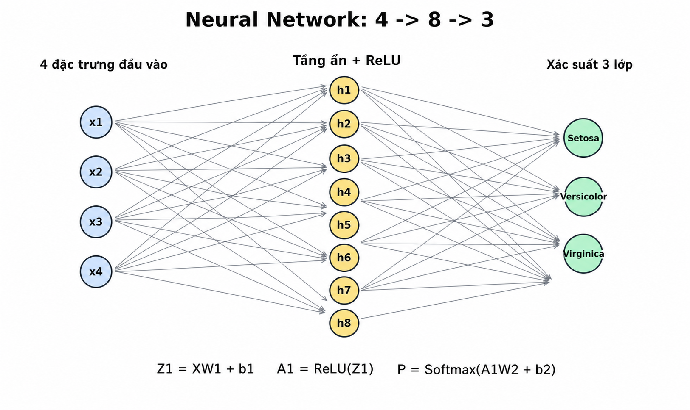

# Câu 2 - Neural Network phân loại hoa Iris

## Đề bài

Cho tập dữ liệu `input_2.csv` gồm 75 mẫu, mỗi mẫu có 4 đặc trưng:

1. Chiều dài đài hoa
2. Chiều rộng đài hoa
3. Chiều dài cánh hoa
4. Chiều rộng cánh hoa

Mỗi mẫu có nhãn loài hoa tương ứng. Cần học từ `input_2.csv` và dự đoán nhãn cho 30 mẫu trong `output_2.csv`.

Mô hình sử dụng trong báo cáo này:

```text
Neural Network tự cài đặt bằng NumPy
```

File code:

```text
cau2_neural_network.py
```

---

## a) Xây dựng hàm mục tiêu, hàm mất mát

### Trả lời: Hàm mất mát

Bài toán có 3 lớp:

- `Iris-setosa`
- `Iris-versicolor`
- `Iris-virginica`

Vì đây là bài toán phân loại nhiều lớp, em dùng:

```text
Softmax + Cross-Entropy Loss
```

Softmax chuyển đầu ra của mạng thành xác suất:

```text
p_i = exp(z_i) / sum(exp(z_j))
```

Cross-Entropy Loss:

```text
Loss = -1/m * sum(y * log(y_hat))
```

Trong đó:

- `m`: số mẫu huấn luyện.
- `y`: nhãn thật dạng one-hot.
- `y_hat`: xác suất dự đoán.
- Loss càng nhỏ thì mô hình dự đoán càng tốt.

### Trả lời: Dán code hàm loss

```python
def softmax(Z):
    shifted = Z - np.max(Z, axis=1, keepdims=True)
    exp_scores = np.exp(shifted)
    return exp_scores / np.sum(exp_scores, axis=1, keepdims=True)


def cross_entropy_loss(y_true_one_hot, y_pred_proba):
    eps = 1e-12
    clipped = np.clip(y_pred_proba, eps, 1 - eps)
    return -np.mean(np.sum(y_true_one_hot * np.log(clipped), axis=1))
```

---

## b) Viết chương trình phân loại hoa

### Trả lời: Kiến trúc mạng

Em sử dụng **mạng neural truyền thẳng** có 1 tầng ẩn. Đây là mô hình thuộc nhóm `NN` theo yêu cầu ôn tập của thầy.

Kiến trúc tổng quát:

```text
4 -> 8 -> 3
```

Hình minh họa kiến trúc mạng:



Ý nghĩa hình:

- Tầng đầu vào gồm 4 neuron, tương ứng 4 đặc trưng của hoa Iris.
- Tầng ẩn gồm 8 neuron, nhận thông tin từ toàn bộ 4 đặc trưng đầu vào.
- Hàm kích hoạt ReLU được dùng ở tầng ẩn để tạo tính phi tuyến.
- Tầng đầu ra gồm 3 neuron, tương ứng 3 loài hoa.
- Softmax biến điểm số ở tầng đầu ra thành xác suất để chọn nhãn dự đoán.

Trong đó:

| Thành phần | Số neuron | Vai trò |
|---|---:|---|
| Input layer | 4 | Nhận 4 đặc trưng của hoa |
| Hidden layer | 8 | Học quan hệ giữa các đặc trưng |
| Output layer | 3 | Trả về điểm/xác suất cho 3 loài hoa |

Tóm tắt theo đúng yêu cầu mô tả mô hình phân loại:

- Mạng có tổng cộng 15 neuron chính: 4 neuron đầu vào, 8 neuron tầng ẩn và 3 neuron đầu ra.
- 4 neuron đầu vào nhận 4 đặc trưng số của một mẫu hoa.
- 8 neuron tầng ẩn học các tổ hợp đặc trưng sau khi nhân trọng số, cộng bias và qua ReLU.
- 3 neuron đầu ra phụ trách 3 loài hoa: neuron 0 cho `Iris-setosa`, neuron 1 cho `Iris-versicolor`, neuron 2 cho `Iris-virginica`.
- Softmax chuyển 3 giá trị đầu ra thành xác suất.
- Mô hình phân loại bằng cách chọn neuron đầu ra có xác suất lớn nhất.

4 neuron đầu vào tương ứng với:

```text
x1 = chiều dài đài hoa
x2 = chiều rộng đài hoa
x3 = chiều dài cánh hoa
x4 = chiều rộng cánh hoa
```

Tầng ẩn có 8 neuron. Mỗi neuron ở tầng ẩn nhận cả 4 đặc trưng đầu vào, nhân với trọng số, cộng bias, rồi đi qua hàm kích hoạt ReLU:

```text
Z1 = XW1 + b1
A1 = ReLU(Z1)
```

Kích thước các ma trận:

```text
X  : m x 4
W1 : 4 x 8
b1 : 1 x 8
Z1 : m x 8
A1 : m x 8
```

Trong đó `m` là số mẫu dữ liệu. Với tập huấn luyện, `m = 75`.

Hàm ReLU:

```text
ReLU(z) = max(0, z)
```

Vai trò của ReLU:

- Tạo tính phi tuyến cho mạng.
- Giúp mạng học được ranh giới phân loại phức tạp hơn mô hình tuyến tính.
- Nếu không có ReLU, nhiều tầng tuyến tính gộp lại vẫn chỉ tương đương một mô hình tuyến tính.

Tầng đầu ra có 3 neuron:

```text
Neuron 0: Iris-setosa
Neuron 1: Iris-versicolor
Neuron 2: Iris-virginica
```

Từ tầng ẩn sang tầng đầu ra:

```text
Z2 = A1W2 + b2
A2 = Softmax(Z2)
```

Kích thước:

```text
W2 : 8 x 3
b2 : 1 x 3
Z2 : m x 3
A2 : m x 3
```

`A2` là ma trận xác suất. Mỗi dòng của `A2` có 3 giá trị và tổng bằng 1.

Ví dụ:

```text
A2 = [0.01, 0.96, 0.03]
```

Mô hình chọn lớp có xác suất lớn nhất:

```text
argmax(A2) = 1
```

Nhãn dự đoán là:

```text
Iris-versicolor
```

Lý do chọn kiến trúc `4 -> 8 -> 3`:

- Dữ liệu đầu vào chỉ có 4 đặc trưng nên input layer cần 4 neuron.
- Bài toán có 3 loài hoa nên output layer cần 3 neuron.
- Tầng ẩn 8 neuron là đủ nhỏ để dễ cài đặt, dễ giải thích, nhưng vẫn có khả năng học quan hệ phi tuyến.
- Tập dữ liệu chỉ có 75 mẫu, nên không nên dùng mạng quá lớn vì dễ học vẹt.

Tóm lại, luồng xử lý của mạng là:

```text
4 đặc trưng
-> tầng ẩn 8 neuron + ReLU
-> tầng ra 3 neuron + Softmax
-> chọn nhãn có xác suất cao nhất
```

## Bổ sung: Data augmentation cho tập huấn luyện

Trước khi huấn luyện mô hình, em bổ sung bước data augmentation cho tập `input_2.csv`.

Vì dữ liệu Iris là dữ liệu bảng gồm 4 đặc trưng số:

```text
sepal_length, sepal_width, petal_length, petal_width
```

nên không dùng các phép augmentation ảnh như xoay, lật, crop. Thay vào đó, chương trình tạo thêm mẫu bằng cách cộng nhiễu Gaussian nhỏ vào từng đặc trưng theo từng lớp hoa.

Quy trình trong code:

1. Đọc dữ liệu gốc từ `input_2.csv`.
2. Tách dữ liệu theo từng lớp hoa.
3. Với mỗi lớp, tính độ lệch chuẩn của từng đặc trưng.
4. Tạo thêm `copies_per_sample = 2` bản sao nhiễu cho mỗi mẫu gốc.
5. Nhiễu được sinh theo công thức:

```text
noise = Normal(0, std_theo_lop * noise_scale)
```

với `noise_scale = 0.04`.

6. Sau khi cộng nhiễu, giá trị đặc trưng được chặn dưới tại `clip_min = 0.01` để tránh số âm.
7. Gộp dữ liệu gốc và dữ liệu sinh thêm thành tập train mới.
8. Lưu tập dữ liệu sau augmentation vào `nn_input_2_augmented.csv`.

Các tham số augmentation nằm trực tiếp trong biến `AUGMENTATION_CONFIG` của file `cau2_neural_network.py`:

```python
AUGMENTATION_CONFIG = {
    "enabled": True,
    "output_file": "nn_input_2_augmented.csv",
    "copies_per_sample": 2,
    "noise_scale": 0.04,
    "random_state": 42,
    "clip_min": 0.01,
}
```

Số lượng dữ liệu:

```text
Số mẫu gốc: 75
Số mẫu sau augmentation: 225
```

Trong phiên bản này, Neural Network được train bằng dữ liệu sau augmentation.

Kết quả sau augmentation:

```text
Accuracy train sau augmentation: 97.33%
Loss cuối sau augmentation: 0.052811
```

### Trả lời: Dán code chính

Dưới đây là toàn bộ chương trình hoàn thiện sau khi đã bổ sung data augmentation. Có thể copy nguyên khối code này để chạy:

```python
from pathlib import Path
import csv

import matplotlib.pyplot as plt
import numpy as np


CLASS_NAMES = ["Iris-setosa", "Iris-versicolor", "Iris-virginica"]
AUGMENTATION_CONFIG = {
    "enabled": True,
    "output_file": "nn_input_2_augmented.csv",
    "copies_per_sample": 2,
    "noise_scale": 0.04,
    "random_state": 42,
    "clip_min": 0.01,
}


def read_training_data(file_path):
    X = []
    y_text = []

    with open(file_path, newline="", encoding="utf-8-sig") as f:
        reader = csv.reader(f)

        for row in reader:
            X.append([float(value) for value in row[:4]])
            y_text.append(row[4])

    label_to_id = {label: index for index, label in enumerate(CLASS_NAMES)}
    y = np.array([label_to_id[label] for label in y_text], dtype=int)
    return np.array(X, dtype=float), y


def augment_training_data(X, y, copies_per_sample=2, noise_scale=0.04, random_state=42, clip_min=0.01):
    rng = np.random.default_rng(random_state)
    augmented_X = [X]
    augmented_y = [y]

    for _ in range(copies_per_sample):
        synthetic_rows = []
        synthetic_labels = []

        for class_id in range(len(CLASS_NAMES)):
            class_points = X[y == class_id]
            class_std = np.std(class_points, axis=0)
            class_std[class_std == 0] = 1
            noise = rng.normal(0, class_std * noise_scale, size=class_points.shape)
            synthetic = np.clip(class_points + noise, a_min=clip_min, a_max=None)
            synthetic_rows.append(synthetic)
            synthetic_labels.append(np.full(len(class_points), class_id, dtype=int))

        augmented_X.append(np.vstack(synthetic_rows))
        augmented_y.append(np.concatenate(synthetic_labels))

    return np.vstack(augmented_X), np.concatenate(augmented_y)


def save_augmented_training_data(file_path, X, y):
    with open(file_path, "w", newline="", encoding="utf-8-sig") as f:
        writer = csv.writer(f)

        for features, label_id in zip(X, y):
            writer.writerow([f"{value:.6f}" for value in features] + [CLASS_NAMES[int(label_id)]])


def read_output_data(file_path):
    X = []

    with open(file_path, newline="", encoding="utf-8-sig") as f:
        reader = csv.reader(f)

        for row in reader:
            X.append([float(value) for value in row[:4]])

    return np.array(X, dtype=float)


def one_hot_encode(y, num_classes):
    y_one_hot = np.zeros((len(y), num_classes))
    y_one_hot[np.arange(len(y)), y] = 1
    return y_one_hot


def standardize_train(X):
    mean = np.mean(X, axis=0)
    std = np.std(X, axis=0)
    std[std == 0] = 1
    return (X - mean) / std, mean, std


def standardize_apply(X, mean, std):
    return (X - mean) / std


def relu(Z):
    return np.maximum(0, Z)


def relu_derivative(Z):
    return (Z > 0).astype(float)


def softmax(Z):
    shifted = Z - np.max(Z, axis=1, keepdims=True)
    exp_scores = np.exp(shifted)
    return exp_scores / np.sum(exp_scores, axis=1, keepdims=True)


def cross_entropy_loss(y_true_one_hot, y_pred_proba):
    eps = 1e-12
    clipped = np.clip(y_pred_proba, eps, 1 - eps)
    return -np.mean(np.sum(y_true_one_hot * np.log(clipped), axis=1))


def initialize_parameters(input_size, hidden_size, output_size, seed=42):
    rng = np.random.default_rng(seed)
    return {
        "W1": rng.normal(0, np.sqrt(2 / input_size), size=(input_size, hidden_size)),
        "b1": np.zeros((1, hidden_size)),
        "W2": rng.normal(0, np.sqrt(2 / hidden_size), size=(hidden_size, output_size)),
        "b2": np.zeros((1, output_size)),
    }


def forward_propagation(X, parameters):
    Z1 = X @ parameters["W1"] + parameters["b1"]
    A1 = relu(Z1)
    Z2 = A1 @ parameters["W2"] + parameters["b2"]
    A2 = softmax(Z2)
    return A2, {"Z1": Z1, "A1": A1, "Z2": Z2, "A2": A2}


def backward_propagation(X, y_one_hot, parameters, cache):
    m = X.shape[0]
    dZ2 = (cache["A2"] - y_one_hot) / m
    dW2 = cache["A1"].T @ dZ2
    db2 = np.sum(dZ2, axis=0, keepdims=True)
    dA1 = dZ2 @ parameters["W2"].T
    dZ1 = dA1 * relu_derivative(cache["Z1"])
    dW1 = X.T @ dZ1
    db1 = np.sum(dZ1, axis=0, keepdims=True)
    return {"dW1": dW1, "db1": db1, "dW2": dW2, "db2": db2}


def update_parameters(parameters, gradients, learning_rate):
    parameters["W1"] -= learning_rate * gradients["dW1"]
    parameters["b1"] -= learning_rate * gradients["db1"]
    parameters["W2"] -= learning_rate * gradients["dW2"]
    parameters["b2"] -= learning_rate * gradients["db2"]


def train_neural_network(X, y, hidden_size=8, epochs=5000, learning_rate=0.05):
    y_one_hot = one_hot_encode(y, len(CLASS_NAMES))
    parameters = initialize_parameters(X.shape[1], hidden_size, len(CLASS_NAMES))
    history = []

    for epoch in range(1, epochs + 1):
        y_pred_proba, cache = forward_propagation(X, parameters)
        loss = cross_entropy_loss(y_one_hot, y_pred_proba)
        gradients = backward_propagation(X, y_one_hot, parameters, cache)
        update_parameters(parameters, gradients, learning_rate)

        if epoch == 1 or epoch % 500 == 0:
            history.append((epoch, loss))

    return parameters, history


def predict(X, parameters):
    probabilities, _ = forward_propagation(X, parameters)
    label_ids = np.argmax(probabilities, axis=1)
    labels = [CLASS_NAMES[label_id] for label_id in label_ids]
    return label_ids, labels, probabilities


def accuracy_score(y_true, y_pred):
    return np.mean(y_true == y_pred)


def build_confusion_matrix(y_true, y_pred):
    matrix = np.zeros((len(CLASS_NAMES), len(CLASS_NAMES)), dtype=int)

    for true_label, pred_label in zip(y_true, y_pred):
        matrix[true_label, pred_label] += 1

    return matrix


def save_loss_chart(history, output_file, title):
    epochs = [item[0] for item in history]
    losses = [item[1] for item in history]

    plt.figure(figsize=(7, 5))
    plt.plot(epochs, losses, marker="o", linewidth=2)
    plt.xlabel("Epoch")
    plt.ylabel("Cross-Entropy Loss")
    plt.title(title)
    plt.grid(True, alpha=0.3)
    plt.tight_layout()
    plt.savefig(output_file, dpi=160)
    plt.close()


def save_confusion_matrix_chart(matrix, output_file, title):
    plt.figure(figsize=(6, 5))
    plt.imshow(matrix, cmap="Blues")
    plt.title(title)
    plt.xlabel("Nhan du doan")
    plt.ylabel("Nhan that")
    plt.xticks(range(len(CLASS_NAMES)), CLASS_NAMES, rotation=25, ha="right")
    plt.yticks(range(len(CLASS_NAMES)), CLASS_NAMES)
    plt.colorbar(label="So mau")

    for i in range(matrix.shape[0]):
        for j in range(matrix.shape[1]):
            color = "white" if matrix[i, j] > np.max(matrix) / 2 else "black"
            plt.text(j, i, str(matrix[i, j]), ha="center", va="center", color=color)

    plt.tight_layout()
    plt.savefig(output_file, dpi=160)
    plt.close()


def save_feature_scatter_chart(X_train, y_train, X_output, output_labels, output_file, title):
    plt.figure(figsize=(8, 5))
    colors = ["tab:blue", "tab:orange", "tab:green"]

    for label_id, class_name in enumerate(CLASS_NAMES):
        points = X_train[y_train == label_id]
        plt.scatter(points[:, 2], points[:, 3], c=colors[label_id], label=f"Train {class_name}", s=35, alpha=0.75)

    for label_id, class_name in enumerate(CLASS_NAMES):
        predicted_points = X_output[np.array(output_labels) == class_name]
        plt.scatter(predicted_points[:, 2], predicted_points[:, 3], c=colors[label_id], marker="x", s=90, linewidths=2, label=f"Output {class_name}")

    plt.xlabel("Chieu dai canh hoa")
    plt.ylabel("Chieu rong canh hoa")
    plt.title(title)
    plt.legend(fontsize=8)
    plt.grid(True, alpha=0.3)
    plt.tight_layout()
    plt.savefig(output_file, dpi=160)
    plt.close()


def save_predictions(output_rows, labels, probabilities, output_file):
    fieldnames = ["sepal_length", "sepal_width", "petal_length", "petal_width", "predicted_label", "probability"]

    with open(output_file, "w", newline="", encoding="utf-8-sig") as f:
        writer = csv.DictWriter(f, fieldnames=fieldnames)
        writer.writeheader()

        for row, label, proba in zip(output_rows, labels, probabilities):
            writer.writerow({
                "sepal_length": row[0],
                "sepal_width": row[1],
                "petal_length": row[2],
                "petal_width": row[3],
                "predicted_label": label,
                "probability": f"{np.max(proba):.6f}",
            })


def main():
    current_dir = Path(__file__).resolve().parent
    data_dir = current_dir.parent
    train_file = data_dir / "input_2.csv"
    predict_file = data_dir / "output_2.csv"

    X_train, y_train = read_training_data(train_file)
    if AUGMENTATION_CONFIG["enabled"]:
        X_train_augmented, y_train_augmented = augment_training_data(
            X_train,
            y_train,
            copies_per_sample=int(AUGMENTATION_CONFIG["copies_per_sample"]),
            noise_scale=float(AUGMENTATION_CONFIG["noise_scale"]),
            random_state=int(AUGMENTATION_CONFIG["random_state"]),
            clip_min=float(AUGMENTATION_CONFIG["clip_min"]),
        )
    else:
        X_train_augmented, y_train_augmented = X_train, y_train

    augmented_file = current_dir / AUGMENTATION_CONFIG["output_file"]
    save_augmented_training_data(augmented_file, X_train_augmented, y_train_augmented)
    X_output = read_output_data(predict_file)
    X_train_scaled, mean, std = standardize_train(X_train_augmented)
    X_output_scaled = standardize_apply(X_output, mean, std)

    parameters, history = train_neural_network(X_train_scaled, y_train_augmented)
    train_pred_ids, _, _ = predict(X_train_scaled, parameters)
    _, output_labels, output_probabilities = predict(X_output_scaled, parameters)
    accuracy = accuracy_score(y_train_augmented, train_pred_ids)
    matrix = build_confusion_matrix(y_train_augmented, train_pred_ids)

    save_predictions(X_output, output_labels, output_probabilities, current_dir / "nn_predictions.csv")
    save_loss_chart(history, current_dir / "nn_loss.png", "Neural Network - Qua trinh giam loss")
    save_confusion_matrix_chart(matrix, current_dir / "nn_confusion_matrix.png", "Neural Network - Confusion Matrix")
    save_feature_scatter_chart(X_train_augmented, y_train_augmented, X_output, output_labels, current_dir / "nn_feature_scatter.png", "Neural Network - Phan bo du lieu sau augmentation")

    print("NEURAL NETWORK")
    print("Kien truc: 4 -> 8 -> 3")
    print(f"Data augmentation enabled: {AUGMENTATION_CONFIG['enabled']}")
    print(f"Augmentation copies_per_sample: {AUGMENTATION_CONFIG['copies_per_sample']}")
    print(f"Augmentation noise_scale: {AUGMENTATION_CONFIG['noise_scale']}")
    print(f"Augmentation random_state: {AUGMENTATION_CONFIG['random_state']}")
    print(f"So mau goc: {len(X_train)}")
    print(f"So mau sau augmentation: {len(X_train_augmented)}")
    print(f"Da luu du lieu augmentation: {augmented_file}")
    print(f"Loss cuoi: {history[-1][1]:.6f}")
    print(f"Accuracy train: {accuracy * 100:.2f}%")
    print("Nhan du doan 30 mau:")

    for index, (label, proba) in enumerate(zip(output_labels, output_probabilities), start=1):
        print(f"{index:>2}. {label:<16} {np.max(proba):.6f}")


if __name__ == "__main__":
    main()
```

---

## c) Thực thi chương trình

### Trả lời: Lệnh chạy

```powershell
python "2025/De2/CNN_Cau2 data agument/01_Neural_Network/cau2_neural_network.py"
```

Kết quả:

```text
Loss cuoi: 0.052811
Accuracy train: 97.33%
```

### Trả lời: Dán kết quả nhãn ứng với 30 mẫu

| STT | Nhãn dự đoán | Xác suất |
|---:|---|---:|
| 1 | Iris-setosa | 0.999990 |
| 2 | Iris-setosa | 0.999994 |
| 3 | Iris-setosa | 0.999867 |
| 4 | Iris-setosa | 0.999994 |
| 5 | Iris-setosa | 0.999963 |
| 6 | Iris-setosa | 0.999815 |
| 7 | Iris-setosa | 0.999985 |
| 8 | Iris-setosa | 0.999993 |
| 9 | Iris-setosa | 0.999854 |
| 10 | Iris-setosa | 0.999994 |
| 11 | Iris-versicolor | 0.997581 |
| 12 | Iris-versicolor | 0.984927 |
| 13 | Iris-versicolor | 0.988504 |
| 14 | Iris-versicolor | 0.999923 |
| 15 | Iris-versicolor | 0.991580 |
| 16 | Iris-versicolor | 0.998891 |
| 17 | Iris-versicolor | 0.987450 |
| 18 | Iris-versicolor | 0.985922 |
| 19 | Iris-versicolor | 0.999069 |
| 20 | Iris-versicolor | 0.994833 |
| 21 | Iris-versicolor | 0.999768 |
| 22 | Iris-versicolor | 0.993832 |
| 23 | Iris-versicolor | 0.999991 |
| 24 | Iris-virginica | 0.992360 |
| 25 | Iris-virginica | 0.999977 |
| 26 | Iris-virginica | 0.999331 |
| 27 | Iris-virginica | 0.999997 |
| 28 | Iris-virginica | 0.999999 |
| 29 | Iris-versicolor | 0.965885 |
| 30 | Iris-virginica | 0.999896 |

Kết luận: Neural Network cho kết quả tốt nhất trong 3 mô hình, đạt `97.33%` trên tập huấn luyện.
