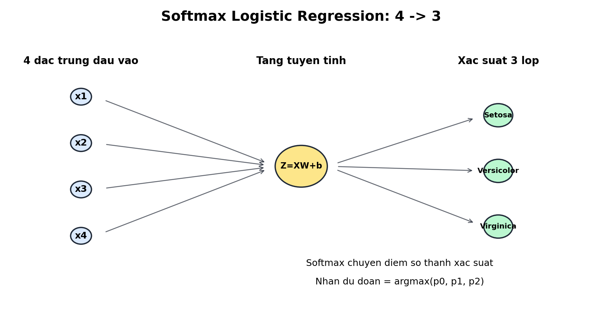

# Câu 2 - Phân loại hoa Iris bằng Softmax Logistic Regression

## Đề bài

Cho tập dữ liệu `input_2.csv` gồm 75 mẫu dữ liệu. Mỗi mẫu có 4 đặc trưng:

1. Chiều dài đài hoa
2. Chiều rộng đài hoa
3. Chiều dài cánh hoa
4. Chiều rộng cánh hoa

Mỗi mẫu có tên loài hoa tương ứng. Cần xây dựng chương trình học từ 75 mẫu trong `input_2.csv` và dự đoán nhãn cho 30 mẫu trong `output_2.csv`.

Trong báo cáo này, em sử dụng mô hình:

```text
Softmax Logistic Regression
```

Đây là phiên bản nhiều lớp của Logistic Regression, phù hợp với bài toán phân loại 3 loài hoa Iris.

File chương trình:

```text
cau2_softmax_logistic.py
```

---

## a) Xây dựng hàm mục tiêu, hàm mất mát cho bài toán

### Trả lời: Hàm mất mát

Vì bài toán có 3 lớp:

```text
Iris-setosa
Iris-versicolor
Iris-virginica
```

nên Logistic Regression nhị phân thông thường không đủ. Em dùng **Softmax Regression**, còn gọi là Logistic Regression đa lớp.

Mô hình tính điểm cho 3 lớp:

```text
Z = XW + b
```

Sau đó dùng hàm Softmax để chuyển điểm số thành xác suất:

```text
p_i = exp(z_i) / sum(exp(z_j))
```

Trong đó:

- `z_i`: điểm số của lớp thứ `i`
- `p_i`: xác suất mẫu thuộc lớp thứ `i`
- Tổng xác suất của 3 lớp bằng 1

Hàm mất mát được dùng là **Cross-Entropy Loss**:

```text
Loss = -1/m * sum(y * log(y_hat))
```

Trong đó:

- `m`: số mẫu huấn luyện
- `y`: nhãn thật ở dạng one-hot
- `y_hat`: xác suất dự đoán sau Softmax
- Loss càng nhỏ thì mô hình phân loại càng tốt

### Trả lời: Dán code của hàm loss

```python
def softmax(Z):
    shifted = Z - np.max(Z, axis=1, keepdims=True)
    exp_scores = np.exp(shifted)
    return exp_scores / np.sum(exp_scores, axis=1, keepdims=True)


def cross_entropy_loss(y_true_one_hot, y_pred_proba):
    eps = 1e-12
    clipped = np.clip(y_pred_proba, eps, 1 - eps)
    return -np.mean(np.sum(y_true_one_hot * np.log(clipped), axis=1))
```

Giải thích:

- `shifted = Z - max(Z)` giúp tránh tràn số khi tính `exp`.
- `np.clip` tránh lỗi `log(0)`.
- `np.mean(...)` lấy loss trung bình trên toàn bộ tập huấn luyện.

---

## b) Hãy viết chương trình phân loại hoa

### Trả lời: Kiến trúc mô hình và cách phân loại

Softmax Logistic Regression là mô hình tuyến tính nhiều lớp. Đây là phiên bản mở rộng của Logistic Regression cho bài toán có nhiều hơn 2 lớp.

Kiến trúc:

```text
4 -> 3
```

Hình minh họa kiến trúc mô hình:



Ý nghĩa hình:

- Mô hình nhận 4 đặc trưng đầu vào của hoa Iris.
- Các đặc trưng được đưa qua một tầng tuyến tính để tính điểm số cho 3 lớp.
- Không có tầng ẩn, nên đây là mô hình tuyến tính.
- Softmax chuyển 3 điểm số thành 3 xác suất.
- Nhãn dự đoán là lớp có xác suất lớn nhất.

Trong đó:

| Thành phần | Số lượng | Vai trò |
|---|---:|---|
| Input | 4 | Nhận 4 đặc trưng hoa Iris |
| Output | 3 | Tính điểm cho 3 loài hoa |

Nếu xem theo cách diễn đạt bằng neuron, mô hình có 4 neuron đầu vào và 3 neuron đầu ra:

- 4 neuron đầu vào chỉ làm nhiệm vụ nhận giá trị đặc trưng của mẫu hoa.
- Neuron đầu ra thứ 0 phụ trách tính điểm/xác suất cho lớp `Iris-setosa`.
- Neuron đầu ra thứ 1 phụ trách tính điểm/xác suất cho lớp `Iris-versicolor`.
- Neuron đầu ra thứ 2 phụ trách tính điểm/xác suất cho lớp `Iris-virginica`.

Mỗi neuron đầu ra nối với cả 4 đặc trưng đầu vào. Vì vậy, mỗi lớp có một bộ trọng số riêng để đánh giá mẫu hoa có giống lớp đó hay không.

4 đầu vào là:

```text
x1 = chiều dài đài hoa
x2 = chiều rộng đài hoa
x3 = chiều dài cánh hoa
x4 = chiều rộng cánh hoa
```

3 đầu ra tương ứng với:

```text
0 = Iris-setosa
1 = Iris-versicolor
2 = Iris-virginica
```

Mô hình không có tầng ẩn. Vì vậy nó học trực tiếp mối quan hệ tuyến tính giữa 4 đặc trưng và 3 lớp hoa.

Trong code, em thêm bias bằng cách thêm một cột `1` vào dữ liệu:

```text
[x1, x2, x3, x4] -> [1, x1, x2, x3, x4]
```

Vì vậy ma trận trọng số có kích thước:

```text
5 x 3
```

Giải thích kích thước:

```text
X_bias : m x 5
W      : 5 x 3
Z      : m x 3
```

Trong đó:

- `m` là số mẫu dữ liệu.
- `5` gồm 1 bias và 4 đặc trưng.
- `3` là số lớp cần phân loại.

Với một mẫu dữ liệu, mô hình tính:

```text
score_setosa     = b0 + w01*x1 + w02*x2 + w03*x3 + w04*x4
score_versicolor = b1 + w11*x1 + w12*x2 + w13*x3 + w14*x4
score_virginica  = b2 + w21*x1 + w22*x2 + w23*x3 + w24*x4
```

Ba điểm số này chưa phải xác suất. Vì vậy ta đưa chúng qua Softmax:

```text
[score_0, score_1, score_2] -> [p0, p1, p2]
```

Trong đó:

```text
p0 + p1 + p2 = 1
```

Cách phân loại:

1. Tính điểm số:

```text
Z = XW
```

2. Tính xác suất:

```text
y_hat = softmax(Z)
```

3. Chọn lớp có xác suất lớn nhất:

```text
label = argmax(y_hat)
```

Ví dụ:

```text
y_hat = [0.01, 0.95, 0.04]
```

thì mô hình dự đoán là lớp thứ 2, tức `Iris-versicolor`.

Lý do dùng Softmax Logistic Regression:

- Phù hợp với yêu cầu `logistic` trong phần ôn tập của thầy.
- Bài toán có 3 lớp nên dùng Softmax thay cho sigmoid nhị phân.
- Mô hình đơn giản, dễ cài đặt, dễ giải thích.
- Là mô hình tuyến tính nên thường dùng làm baseline để so sánh với Neural Network.

Hạn chế:

- Không có tầng ẩn nên chỉ học được ranh giới tuyến tính.
- Nếu dữ liệu có quan hệ phi tuyến phức tạp, kết quả có thể kém hơn Neural Network.

## Bổ sung: Data augmentation cho tập huấn luyện

Trước khi huấn luyện mô hình, em bổ sung bước data augmentation cho tập `input_2.csv`.

Vì dữ liệu Iris là dữ liệu bảng gồm 4 đặc trưng số:

```text
sepal_length, sepal_width, petal_length, petal_width
```

nên không dùng các phép augmentation ảnh như xoay, lật, crop. Thay vào đó, chương trình tạo thêm mẫu bằng cách cộng nhiễu Gaussian nhỏ vào từng đặc trưng theo từng lớp hoa.

Quy trình trong code:

1. Đọc dữ liệu gốc từ `input_2.csv`.
2. Tách dữ liệu theo từng lớp hoa.
3. Với mỗi lớp, tính độ lệch chuẩn của từng đặc trưng.
4. Tạo thêm `copies_per_sample = 2` bản sao nhiễu cho mỗi mẫu gốc.
5. Nhiễu được sinh theo công thức:

```text
noise = Normal(0, std_theo_lop * noise_scale)
```

với `noise_scale = 0.04`.

6. Sau khi cộng nhiễu, giá trị đặc trưng được chặn dưới tại `clip_min = 0.01` để tránh số âm.
7. Gộp dữ liệu gốc và dữ liệu sinh thêm thành tập train mới.
8. Lưu tập dữ liệu sau augmentation vào `softmax_input_2_augmented.csv`.

Các tham số augmentation nằm trực tiếp trong biến `AUGMENTATION_CONFIG` của file `cau2_softmax_logistic.py`:

```python
AUGMENTATION_CONFIG = {
    "enabled": True,
    "output_file": "softmax_input_2_augmented.csv",
    "copies_per_sample": 2,
    "noise_scale": 0.04,
    "random_state": 42,
    "clip_min": 0.01,
}
```

Số lượng dữ liệu:

```text
Số mẫu gốc: 75
Số mẫu sau augmentation: 225
```

Trong phiên bản này, Softmax Logistic Regression được train bằng dữ liệu sau augmentation.

Kết quả sau augmentation:

```text
Accuracy train sau augmentation: 94.67%
Loss cuối sau augmentation: 0.096295
```

### Trả lời: Dán code vào đây

Dưới đây là toàn bộ chương trình hoàn thiện sau khi đã bổ sung data augmentation. Có thể copy nguyên khối code này để chạy:

```python
from pathlib import Path
import csv

import matplotlib.pyplot as plt
import numpy as np


CLASS_NAMES = ["Iris-setosa", "Iris-versicolor", "Iris-virginica"]
AUGMENTATION_CONFIG = {
    "enabled": True,
    "output_file": "softmax_input_2_augmented.csv",
    "copies_per_sample": 2,
    "noise_scale": 0.04,
    "random_state": 42,
    "clip_min": 0.01,
}


def read_training_data(file_path):
    X = []
    y_text = []

    with open(file_path, newline="", encoding="utf-8-sig") as f:
        reader = csv.reader(f)

        for row in reader:
            X.append([float(value) for value in row[:4]])
            y_text.append(row[4])

    label_to_id = {label: index for index, label in enumerate(CLASS_NAMES)}
    y = np.array([label_to_id[label] for label in y_text], dtype=int)
    return np.array(X, dtype=float), y


def augment_training_data(X, y, copies_per_sample=2, noise_scale=0.04, random_state=42, clip_min=0.01):
    rng = np.random.default_rng(random_state)
    augmented_X = [X]
    augmented_y = [y]

    for _ in range(copies_per_sample):
        synthetic_rows = []
        synthetic_labels = []

        for class_id in range(len(CLASS_NAMES)):
            class_points = X[y == class_id]
            class_std = np.std(class_points, axis=0)
            class_std[class_std == 0] = 1
            noise = rng.normal(0, class_std * noise_scale, size=class_points.shape)
            synthetic = np.clip(class_points + noise, a_min=clip_min, a_max=None)
            synthetic_rows.append(synthetic)
            synthetic_labels.append(np.full(len(class_points), class_id, dtype=int))

        augmented_X.append(np.vstack(synthetic_rows))
        augmented_y.append(np.concatenate(synthetic_labels))

    return np.vstack(augmented_X), np.concatenate(augmented_y)


def save_augmented_training_data(file_path, X, y):
    with open(file_path, "w", newline="", encoding="utf-8-sig") as f:
        writer = csv.writer(f)

        for features, label_id in zip(X, y):
            writer.writerow([f"{value:.6f}" for value in features] + [CLASS_NAMES[int(label_id)]])


def read_output_data(file_path):
    X = []

    with open(file_path, newline="", encoding="utf-8-sig") as f:
        reader = csv.reader(f)

        for row in reader:
            X.append([float(value) for value in row[:4]])

    return np.array(X, dtype=float)


def one_hot_encode(y, num_classes):
    y_one_hot = np.zeros((len(y), num_classes))
    y_one_hot[np.arange(len(y)), y] = 1
    return y_one_hot


def standardize_train(X):
    mean = np.mean(X, axis=0)
    std = np.std(X, axis=0)
    std[std == 0] = 1
    return (X - mean) / std, mean, std


def standardize_apply(X, mean, std):
    return (X - mean) / std


def add_bias_column(X):
    return np.c_[np.ones((X.shape[0], 1)), X]


def softmax(Z):
    shifted = Z - np.max(Z, axis=1, keepdims=True)
    exp_scores = np.exp(shifted)
    return exp_scores / np.sum(exp_scores, axis=1, keepdims=True)


def cross_entropy_loss(y_true_one_hot, y_pred_proba):
    eps = 1e-12
    clipped = np.clip(y_pred_proba, eps, 1 - eps)
    return -np.mean(np.sum(y_true_one_hot * np.log(clipped), axis=1))


def train_softmax_regression(X, y, epochs=5000, learning_rate=0.08):
    X_bias = add_bias_column(X)
    y_one_hot = one_hot_encode(y, len(CLASS_NAMES))
    weights = np.zeros((X_bias.shape[1], len(CLASS_NAMES)))
    history = []

    for epoch in range(1, epochs + 1):
        logits = X_bias @ weights
        probabilities = softmax(logits)
        loss = cross_entropy_loss(y_one_hot, probabilities)
        gradients = X_bias.T @ (probabilities - y_one_hot) / X_bias.shape[0]
        weights -= learning_rate * gradients

        if epoch == 1 or epoch % 500 == 0:
            history.append((epoch, loss))

    return weights, history


def predict(X, weights):
    probabilities = softmax(add_bias_column(X) @ weights)
    label_ids = np.argmax(probabilities, axis=1)
    labels = [CLASS_NAMES[label_id] for label_id in label_ids]
    return label_ids, labels, probabilities


def accuracy_score(y_true, y_pred):
    return np.mean(y_true == y_pred)


def build_confusion_matrix(y_true, y_pred):
    matrix = np.zeros((len(CLASS_NAMES), len(CLASS_NAMES)), dtype=int)

    for true_label, pred_label in zip(y_true, y_pred):
        matrix[true_label, pred_label] += 1

    return matrix


def save_loss_chart(history, output_file):
    epochs = [item[0] for item in history]
    losses = [item[1] for item in history]

    plt.figure(figsize=(7, 5))
    plt.plot(epochs, losses, marker="o", linewidth=2)
    plt.xlabel("Epoch")
    plt.ylabel("Cross-Entropy Loss")
    plt.title("Softmax Regression - Qua trinh giam loss")
    plt.grid(True, alpha=0.3)
    plt.tight_layout()
    plt.savefig(output_file, dpi=160)
    plt.close()


def save_confusion_matrix_chart(matrix, output_file):
    plt.figure(figsize=(6, 5))
    plt.imshow(matrix, cmap="Blues")
    plt.title("Softmax Regression - Confusion Matrix")
    plt.xlabel("Nhan du doan")
    plt.ylabel("Nhan that")
    plt.xticks(range(len(CLASS_NAMES)), CLASS_NAMES, rotation=25, ha="right")
    plt.yticks(range(len(CLASS_NAMES)), CLASS_NAMES)
    plt.colorbar(label="So mau")

    for i in range(matrix.shape[0]):
        for j in range(matrix.shape[1]):
            color = "white" if matrix[i, j] > np.max(matrix) / 2 else "black"
            plt.text(j, i, str(matrix[i, j]), ha="center", va="center", color=color)

    plt.tight_layout()
    plt.savefig(output_file, dpi=160)
    plt.close()


def save_feature_scatter_chart(X_train, y_train, X_output, output_labels, output_file):
    plt.figure(figsize=(8, 5))
    colors = ["tab:blue", "tab:orange", "tab:green"]

    for label_id, class_name in enumerate(CLASS_NAMES):
        points = X_train[y_train == label_id]
        plt.scatter(points[:, 2], points[:, 3], c=colors[label_id], label=f"Train {class_name}", s=35, alpha=0.75)

    for label_id, class_name in enumerate(CLASS_NAMES):
        predicted_points = X_output[np.array(output_labels) == class_name]
        plt.scatter(predicted_points[:, 2], predicted_points[:, 3], c=colors[label_id], marker="x", s=90, linewidths=2, label=f"Output {class_name}")

    plt.xlabel("Chieu dai canh hoa")
    plt.ylabel("Chieu rong canh hoa")
    plt.title("Softmax Regression - Phan bo du lieu")
    plt.legend(fontsize=8)
    plt.grid(True, alpha=0.3)
    plt.tight_layout()
    plt.savefig(output_file, dpi=160)
    plt.close()


def save_predictions(output_rows, labels, probabilities, output_file):
    fieldnames = ["sepal_length", "sepal_width", "petal_length", "petal_width", "predicted_label", "probability"]

    with open(output_file, "w", newline="", encoding="utf-8-sig") as f:
        writer = csv.DictWriter(f, fieldnames=fieldnames)
        writer.writeheader()

        for row, label, proba in zip(output_rows, labels, probabilities):
            writer.writerow({
                "sepal_length": row[0],
                "sepal_width": row[1],
                "petal_length": row[2],
                "petal_width": row[3],
                "predicted_label": label,
                "probability": f"{np.max(proba):.6f}",
            })


def main():
    current_dir = Path(__file__).resolve().parent
    data_dir = current_dir.parent
    train_file = data_dir / "input_2.csv"
    predict_file = data_dir / "output_2.csv"

    X_train, y_train = read_training_data(train_file)
    if AUGMENTATION_CONFIG["enabled"]:
        X_train_augmented, y_train_augmented = augment_training_data(
            X_train,
            y_train,
            copies_per_sample=int(AUGMENTATION_CONFIG["copies_per_sample"]),
            noise_scale=float(AUGMENTATION_CONFIG["noise_scale"]),
            random_state=int(AUGMENTATION_CONFIG["random_state"]),
            clip_min=float(AUGMENTATION_CONFIG["clip_min"]),
        )
    else:
        X_train_augmented, y_train_augmented = X_train, y_train

    augmented_file = current_dir / AUGMENTATION_CONFIG["output_file"]
    save_augmented_training_data(augmented_file, X_train_augmented, y_train_augmented)
    X_output = read_output_data(predict_file)
    X_train_scaled, mean, std = standardize_train(X_train_augmented)
    X_output_scaled = standardize_apply(X_output, mean, std)

    weights, history = train_softmax_regression(X_train_scaled, y_train_augmented)
    train_pred_ids, _, _ = predict(X_train_scaled, weights)
    _, output_labels, output_probabilities = predict(X_output_scaled, weights)
    accuracy = accuracy_score(y_train_augmented, train_pred_ids)
    matrix = build_confusion_matrix(y_train_augmented, train_pred_ids)

    save_predictions(X_output, output_labels, output_probabilities, current_dir / "softmax_predictions.csv")
    save_loss_chart(history, current_dir / "softmax_loss.png")
    save_confusion_matrix_chart(matrix, current_dir / "softmax_confusion_matrix.png")
    save_feature_scatter_chart(X_train_augmented, y_train_augmented, X_output, output_labels, current_dir / "softmax_feature_scatter.png")

    print("SOFTMAX LOGISTIC REGRESSION")
    print("Kien truc: 4 -> 3")
    print(f"Data augmentation enabled: {AUGMENTATION_CONFIG['enabled']}")
    print(f"Augmentation copies_per_sample: {AUGMENTATION_CONFIG['copies_per_sample']}")
    print(f"Augmentation noise_scale: {AUGMENTATION_CONFIG['noise_scale']}")
    print(f"Augmentation random_state: {AUGMENTATION_CONFIG['random_state']}")
    print(f"So mau goc: {len(X_train)}")
    print(f"So mau sau augmentation: {len(X_train_augmented)}")
    print(f"Da luu du lieu augmentation: {augmented_file}")
    print(f"Loss cuoi: {history[-1][1]:.6f}")
    print(f"Accuracy train: {accuracy * 100:.2f}%")
    print("Nhan du doan 30 mau:")

    for index, (label, proba) in enumerate(zip(output_labels, output_probabilities), start=1):
        print(f"{index:>2}. {label:<16} {np.max(proba):.6f}")


if __name__ == "__main__":
    main()
```

---

## c) Thực thi chương trình và cho biết nhãn của 30 mẫu trong output.csv

### Trả lời: Dán code thực thi thành công

```python
def main():
    current_dir = Path(__file__).resolve().parent
    data_dir = current_dir.parent
    train_file = data_dir / input_2.csv
    predict_file = data_dir / output_2.csv

    X_train, y_train = read_training_data(train_file)
    if AUGMENTATION_CONFIG["enabled"]:
        X_train_augmented, y_train_augmented = augment_training_data(
            X_train,
            y_train,
            copies_per_sample=int(AUGMENTATION_CONFIG["copies_per_sample"]),
            noise_scale=float(AUGMENTATION_CONFIG["noise_scale"]),
            random_state=int(AUGMENTATION_CONFIG["random_state"]),
            clip_min=float(AUGMENTATION_CONFIG["clip_min"]),
        )
    else:
        X_train_augmented, y_train_augmented = X_train, y_train

    augmented_file = current_dir / AUGMENTATION_CONFIG["output_file"]
    save_augmented_training_data(augmented_file, X_train_augmented, y_train_augmented)

    X_output = read_output_data(predict_file)
    X_train_scaled, mean, std = standardize_train(X_train_augmented)
    X_output_scaled = standardize_apply(X_output, mean, std)

    weights, history = train_softmax_regression(X_train_scaled, y_train_augmented)
    train_pred_ids, _, _ = predict(X_train_scaled, weights)
    _, output_labels, output_probabilities = predict(X_output_scaled, weights)
    accuracy = accuracy_score(y_train_augmented, train_pred_ids)
    matrix = build_confusion_matrix(y_train_augmented, train_pred_ids)
```

Lệnh chạy:

```powershell
python "2025/De2/CNN_Cau2 data agument/02_Softmax_Logistic_Regression/cau2_softmax_logistic.py"
```

Kết quả:

```text
SOFTMAX LOGISTIC REGRESSION
Kien truc: 4 -> 3
Loss cuoi: 0.094787
Accuracy train: 94.67%
```

### Trả lời: Dán kết quả nhãn ứng với 30 mẫu dữ liệu

| STT | Nhãn dự đoán | Xác suất |
|---:|---|---:|
| 1 | Iris-setosa | 0.997756 |
| 2 | Iris-setosa | 0.998386 |
| 3 | Iris-setosa | 0.993448 |
| 4 | Iris-setosa | 0.999156 |
| 5 | Iris-setosa | 0.998786 |
| 6 | Iris-setosa | 0.999695 |
| 7 | Iris-setosa | 0.999069 |
| 8 | Iris-setosa | 0.997686 |
| 9 | Iris-setosa | 0.994061 |
| 10 | Iris-setosa | 0.999351 |
| 11 | Iris-versicolor | 0.979767 |
| 12 | Iris-versicolor | 0.971524 |
| 13 | Iris-versicolor | 0.888371 |
| 14 | Iris-versicolor | 0.987283 |
| 15 | Iris-versicolor | 0.901540 |
| 16 | Iris-versicolor | 0.981114 |
| 17 | Iris-versicolor | 0.906471 |
| 18 | Iris-versicolor | 0.941527 |
| 19 | Iris-versicolor | 0.985287 |
| 20 | Iris-versicolor | 0.974727 |
| 21 | Iris-versicolor | 0.994682 |
| 22 | Iris-versicolor | 0.977198 |
| 23 | Iris-versicolor | 0.998709 |
| 24 | Iris-virginica | 0.964677 |
| 25 | Iris-virginica | 0.998732 |
| 26 | Iris-virginica | 0.970705 |
| 27 | Iris-virginica | 0.999334 |
| 28 | Iris-virginica | 0.999866 |
| 29 | Iris-virginica | 0.567408 |
| 30 | Iris-virginica | 0.996498 |

Kết quả được lưu trong:

```text
softmax_predictions.csv
```

---

## Kết luận

Softmax Logistic Regression là mô hình tuyến tính, dễ cài đặt và dễ giải thích. Mô hình đạt:

```text
Accuracy train = 94.67%
Loss cuối = 0.094787
```

Kết quả thấp hơn Neural Network vì Softmax Logistic Regression không có tầng ẩn, nên khả năng học quan hệ phức tạp kém hơn.
