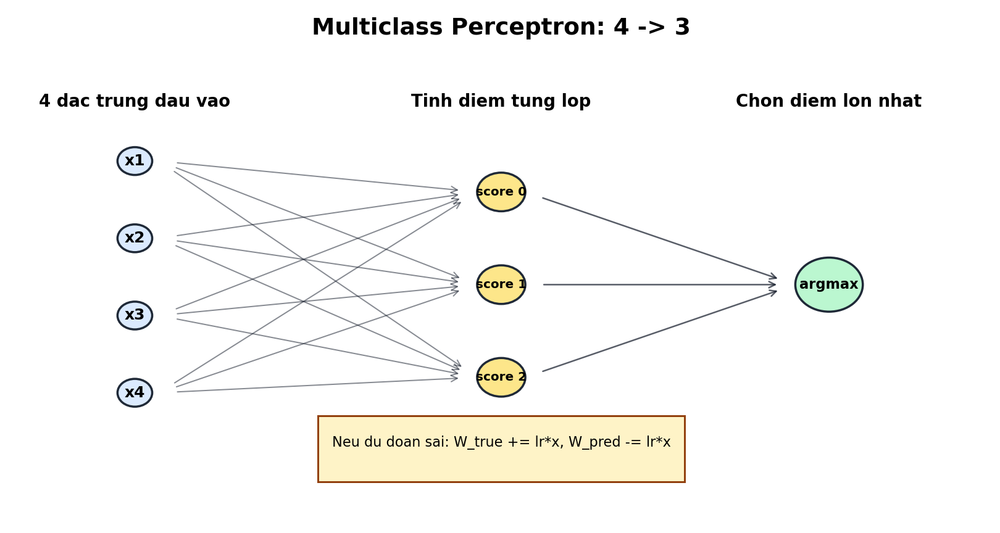

# Câu 2 - Phân loại hoa Iris bằng Multiclass Perceptron

## Đề bài

Cho tập dữ liệu `input_2.csv` gồm 75 mẫu dữ liệu. Mỗi mẫu có 4 đặc trưng:

1. Chiều dài đài hoa
2. Chiều rộng đài hoa
3. Chiều dài cánh hoa
4. Chiều rộng cánh hoa

Mỗi mẫu có tên loài hoa tương ứng. Cần xây dựng chương trình học từ 75 mẫu trong `input_2.csv` và dự đoán nhãn cho 30 mẫu trong `output_2.csv`.

Trong báo cáo này, em sử dụng mô hình:

```text
Multiclass Perceptron
```

File chương trình:

```text
cau2_multiclass_perceptron.py
```

---

## a) Xây dựng hàm mục tiêu, hàm cập nhật cho bài toán

### Trả lời: Hàm mục tiêu của Perceptron

Perceptron là mô hình phân loại tuyến tính. Với mỗi mẫu dữ liệu `x`, mô hình tính điểm cho từng lớp:

```text
score_c = W_c . x
```

Trong đó:

- `W_c`: vector trọng số của lớp `c`
- `x`: vector đặc trưng của mẫu
- `score_c`: điểm số của mẫu đối với lớp `c`

Nhãn dự đoán là lớp có điểm số lớn nhất:

```text
y_pred = argmax(score_c)
```

Khác với Neural Network và Logistic Regression, Perceptron không tối ưu Cross-Entropy Loss. Perceptron học bằng cách cập nhật trọng số khi dự đoán sai.

Nếu dự đoán đúng:

```text
Không cập nhật
```

Nếu dự đoán sai:

```text
W_true = W_true + learning_rate * x
W_pred = W_pred - learning_rate * x
```

Mục tiêu của quá trình học là giảm số mẫu phân loại sai qua các epoch.

### Trả lời: Dán code hàm cập nhật

```python
if pred_label != true_label:
    weights[true_label] += learning_rate * xi
    weights[pred_label] -= learning_rate * xi
    mistakes += 1
```

Giải thích:

- `weights[true_label]` được tăng để mẫu gần hơn với lớp đúng.
- `weights[pred_label]` bị giảm để mẫu xa hơn lớp dự đoán sai.
- `mistakes` đếm số mẫu sai trong epoch hiện tại.

---

## b) Hãy viết chương trình phân loại hoa

### Trả lời: Kiến trúc mô hình và cách phân loại

Multiclass Perceptron là mô hình phân loại tuyến tính. Mô hình này không tính xác suất thật như Softmax Logistic Regression, mà tính **điểm số** cho từng lớp rồi chọn lớp có điểm cao nhất.

Kiến trúc:

```text
4 -> 3
```

Hình minh họa kiến trúc mô hình:



Ý nghĩa hình:

- Mô hình nhận 4 đặc trưng đầu vào của hoa Iris.
- Với mỗi lớp, mô hình tính một điểm số riêng.
- Ba điểm số tương ứng với 3 loài hoa: Setosa, Versicolor, Virginica.
- Mô hình chọn lớp có điểm số lớn nhất bằng `argmax`.
- Khi dự đoán sai, trọng số của lớp đúng được tăng lên và trọng số của lớp dự đoán sai bị giảm xuống.

Trong đó:

| Thành phần | Số lượng | Vai trò |
|---|---:|---|
| Input | 4 | Nhận 4 đặc trưng của hoa |
| Output score | 3 | Tính điểm cho 3 lớp |

Nếu diễn giải theo dạng neuron, mô hình có 4 neuron đầu vào và 3 neuron đầu ra:

- 4 neuron đầu vào nhận 4 đặc trưng của mẫu hoa.
- Neuron đầu ra thứ 0 tính điểm cho lớp `Iris-setosa`.
- Neuron đầu ra thứ 1 tính điểm cho lớp `Iris-versicolor`.
- Neuron đầu ra thứ 2 tính điểm cho lớp `Iris-virginica`.
- Mỗi neuron đầu ra có một vector trọng số riêng.
- Mô hình phân loại bằng cách chọn neuron đầu ra có điểm số lớn nhất.

4 đầu vào là:

```text
x1 = chiều dài đài hoa
x2 = chiều rộng đài hoa
x3 = chiều dài cánh hoa
x4 = chiều rộng cánh hoa
```

3 lớp đầu ra:

```text
0 = Iris-setosa
1 = Iris-versicolor
2 = Iris-virginica
```

Trong code, em thêm bias vào vector đầu vào:

```text
[x1, x2, x3, x4] -> [1, x1, x2, x3, x4]
```

Vì vậy mỗi vector trọng số có 5 giá trị:

```text
[bias, w1, w2, w3, w4]
```

Vì có 3 lớp, mô hình có 3 vector trọng số:

```text
W_setosa     = [b0, w01, w02, w03, w04]
W_versicolor = [b1, w11, w12, w13, w14]
W_virginica  = [b2, w21, w22, w23, w24]
```

Với một mẫu `x`, mô hình tính:

```text
score_setosa     = W_setosa . x
score_versicolor = W_versicolor . x
score_virginica  = W_virginica . x
```

Sau đó chọn lớp có điểm lớn nhất:

```text
y_pred = argmax(score_setosa, score_versicolor, score_virginica)
```

Ví dụ:

```text
scores = [1.2, 3.8, 2.1]
```

Điểm lớn nhất là `3.8`, thuộc lớp thứ 2, nên mô hình dự đoán:

```text
Iris-versicolor
```

Cách học của Perceptron:

- Nếu dự đoán đúng, không thay đổi trọng số.
- Nếu dự đoán sai, tăng trọng số của lớp đúng.
- Đồng thời giảm trọng số của lớp dự đoán sai.

Luật cập nhật:

```text
W_true = W_true + learning_rate * x
W_pred = W_pred - learning_rate * x
```

Ý nghĩa:

- Lần sau, mẫu đó sẽ có xu hướng gần lớp đúng hơn.
- Đồng thời mẫu đó sẽ bớt gần lớp đã dự đoán sai.

Lý do dùng Multiclass Perceptron:

- Phù hợp với nhóm `perceptron` trong yêu cầu ôn tập.
- Cài đặt đơn giản, không cần đạo hàm phức tạp.
- Phù hợp để minh họa nguyên lý học máy: dự đoán sai thì cập nhật.

Hạn chế:

- Không sinh xác suất thật.
- Chỉ học ranh giới tuyến tính.
- Không đảm bảo tối ưu như các mô hình dùng hàm loss trơn như Cross-Entropy.

## Bổ sung: Data augmentation cho tập huấn luyện

Trước khi huấn luyện mô hình, em bổ sung bước data augmentation cho tập `input_2.csv`.

Vì dữ liệu Iris là dữ liệu bảng gồm 4 đặc trưng số:

```text
sepal_length, sepal_width, petal_length, petal_width
```

nên không dùng các phép augmentation ảnh như xoay, lật, crop. Thay vào đó, chương trình tạo thêm mẫu bằng cách cộng nhiễu Gaussian nhỏ vào từng đặc trưng theo từng lớp hoa.

Quy trình trong code:

1. Đọc dữ liệu gốc từ `input_2.csv`.
2. Tách dữ liệu theo từng lớp hoa.
3. Với mỗi lớp, tính độ lệch chuẩn của từng đặc trưng.
4. Tạo thêm `copies_per_sample = 2` bản sao nhiễu cho mỗi mẫu gốc.
5. Nhiễu được sinh theo công thức:

```text
noise = Normal(0, std_theo_lop * noise_scale)
```

với `noise_scale = 0.04`.

6. Sau khi cộng nhiễu, giá trị đặc trưng được chặn dưới tại `clip_min = 0.01` để tránh số âm.
7. Gộp dữ liệu gốc và dữ liệu sinh thêm thành tập train mới.
8. Lưu tập dữ liệu sau augmentation vào `perceptron_input_2_augmented.csv`.

Các tham số augmentation nằm trực tiếp trong biến `AUGMENTATION_CONFIG` của file `cau2_multiclass_perceptron.py`:

```python
AUGMENTATION_CONFIG = {
    "enabled": True,
    "output_file": "perceptron_input_2_augmented.csv",
    "copies_per_sample": 2,
    "noise_scale": 0.04,
    "random_state": 42,
    "clip_min": 0.01,
}
```

Số lượng dữ liệu:

```text
Số mẫu gốc: 75
Số mẫu sau augmentation: 225
```

Trong phiên bản này, Multiclass Perceptron được train bằng dữ liệu sau augmentation.

Kết quả sau augmentation:

```text
Accuracy train sau augmentation: 95.56%
Số lỗi epoch cuối được ghi nhận sau augmentation: 12
```

### Trả lời: Dán code vào đây

Dưới đây là toàn bộ chương trình hoàn thiện sau khi đã bổ sung data augmentation. Có thể copy nguyên khối code này để chạy:

```python
from pathlib import Path
import csv

import matplotlib.pyplot as plt
import numpy as np


CLASS_NAMES = ["Iris-setosa", "Iris-versicolor", "Iris-virginica"]
AUGMENTATION_CONFIG = {
    "enabled": True,
    "output_file": "perceptron_input_2_augmented.csv",
    "copies_per_sample": 2,
    "noise_scale": 0.04,
    "random_state": 42,
    "clip_min": 0.01,
}


def read_training_data(file_path):
    X = []
    y_text = []

    with open(file_path, newline="", encoding="utf-8-sig") as f:
        reader = csv.reader(f)

        for row in reader:
            X.append([float(value) for value in row[:4]])
            y_text.append(row[4])

    label_to_id = {label: index for index, label in enumerate(CLASS_NAMES)}
    y = np.array([label_to_id[label] for label in y_text], dtype=int)
    return np.array(X, dtype=float), y


def augment_training_data(X, y, copies_per_sample=2, noise_scale=0.04, random_state=42, clip_min=0.01):
    rng = np.random.default_rng(random_state)
    augmented_X = [X]
    augmented_y = [y]

    for _ in range(copies_per_sample):
        synthetic_rows = []
        synthetic_labels = []

        for class_id in range(len(CLASS_NAMES)):
            class_points = X[y == class_id]
            class_std = np.std(class_points, axis=0)
            class_std[class_std == 0] = 1
            noise = rng.normal(0, class_std * noise_scale, size=class_points.shape)
            synthetic = np.clip(class_points + noise, a_min=clip_min, a_max=None)
            synthetic_rows.append(synthetic)
            synthetic_labels.append(np.full(len(class_points), class_id, dtype=int))

        augmented_X.append(np.vstack(synthetic_rows))
        augmented_y.append(np.concatenate(synthetic_labels))

    return np.vstack(augmented_X), np.concatenate(augmented_y)


def save_augmented_training_data(file_path, X, y):
    with open(file_path, "w", newline="", encoding="utf-8-sig") as f:
        writer = csv.writer(f)

        for features, label_id in zip(X, y):
            writer.writerow([f"{value:.6f}" for value in features] + [CLASS_NAMES[int(label_id)]])


def read_output_data(file_path):
    X = []

    with open(file_path, newline="", encoding="utf-8-sig") as f:
        reader = csv.reader(f)

        for row in reader:
            X.append([float(value) for value in row[:4]])

    return np.array(X, dtype=float)


def standardize_train(X):
    mean = np.mean(X, axis=0)
    std = np.std(X, axis=0)
    std[std == 0] = 1
    return (X - mean) / std, mean, std


def standardize_apply(X, mean, std):
    return (X - mean) / std


def add_bias_column(X):
    return np.c_[np.ones((X.shape[0], 1)), X]


def train_multiclass_perceptron(X, y, epochs=100, learning_rate=0.1):
    X_bias = add_bias_column(X)
    weights = np.zeros((len(CLASS_NAMES), X_bias.shape[1]))
    history = []

    for epoch in range(1, epochs + 1):
        mistakes = 0

        for xi, true_label in zip(X_bias, y):
            scores = weights @ xi
            pred_label = int(np.argmax(scores))

            if pred_label != true_label:
                weights[true_label] += learning_rate * xi
                weights[pred_label] -= learning_rate * xi
                mistakes += 1

        if epoch == 1 or epoch % 10 == 0:
            history.append((epoch, mistakes))

    return weights, history


def softmax_scores(scores):
    shifted = scores - np.max(scores, axis=1, keepdims=True)
    exp_scores = np.exp(shifted)
    return exp_scores / np.sum(exp_scores, axis=1, keepdims=True)


def predict(X, weights):
    scores = add_bias_column(X) @ weights.T
    probabilities = softmax_scores(scores)
    label_ids = np.argmax(scores, axis=1)
    labels = [CLASS_NAMES[label_id] for label_id in label_ids]
    return label_ids, labels, probabilities


def accuracy_score(y_true, y_pred):
    return np.mean(y_true == y_pred)


def build_confusion_matrix(y_true, y_pred):
    matrix = np.zeros((len(CLASS_NAMES), len(CLASS_NAMES)), dtype=int)

    for true_label, pred_label in zip(y_true, y_pred):
        matrix[true_label, pred_label] += 1

    return matrix


def save_mistake_chart(history, output_file):
    epochs = [item[0] for item in history]
    mistakes = [item[1] for item in history]

    plt.figure(figsize=(7, 5))
    plt.plot(epochs, mistakes, marker="o", linewidth=2)
    plt.xlabel("Epoch")
    plt.ylabel("So mau phan loai sai")
    plt.title("Multiclass Perceptron - So loi qua cac epoch")
    plt.grid(True, alpha=0.3)
    plt.tight_layout()
    plt.savefig(output_file, dpi=160)
    plt.close()


def save_confusion_matrix_chart(matrix, output_file):
    plt.figure(figsize=(6, 5))
    plt.imshow(matrix, cmap="Blues")
    plt.title("Multiclass Perceptron - Confusion Matrix")
    plt.xlabel("Nhan du doan")
    plt.ylabel("Nhan that")
    plt.xticks(range(len(CLASS_NAMES)), CLASS_NAMES, rotation=25, ha="right")
    plt.yticks(range(len(CLASS_NAMES)), CLASS_NAMES)
    plt.colorbar(label="So mau")

    for i in range(matrix.shape[0]):
        for j in range(matrix.shape[1]):
            color = "white" if matrix[i, j] > np.max(matrix) / 2 else "black"
            plt.text(j, i, str(matrix[i, j]), ha="center", va="center", color=color)

    plt.tight_layout()
    plt.savefig(output_file, dpi=160)
    plt.close()


def save_feature_scatter_chart(X_train, y_train, X_output, output_labels, output_file):
    plt.figure(figsize=(8, 5))
    colors = ["tab:blue", "tab:orange", "tab:green"]

    for label_id, class_name in enumerate(CLASS_NAMES):
        points = X_train[y_train == label_id]
        plt.scatter(points[:, 2], points[:, 3], c=colors[label_id], label=f"Train {class_name}", s=35, alpha=0.75)

    for label_id, class_name in enumerate(CLASS_NAMES):
        predicted_points = X_output[np.array(output_labels) == class_name]
        plt.scatter(predicted_points[:, 2], predicted_points[:, 3], c=colors[label_id], marker="x", s=90, linewidths=2, label=f"Output {class_name}")

    plt.xlabel("Chieu dai canh hoa")
    plt.ylabel("Chieu rong canh hoa")
    plt.title("Multiclass Perceptron - Phan bo du lieu")
    plt.legend(fontsize=8)
    plt.grid(True, alpha=0.3)
    plt.tight_layout()
    plt.savefig(output_file, dpi=160)
    plt.close()


def save_predictions(output_rows, labels, probabilities, output_file):
    fieldnames = ["sepal_length", "sepal_width", "petal_length", "petal_width", "predicted_label", "confidence_from_scores"]

    with open(output_file, "w", newline="", encoding="utf-8-sig") as f:
        writer = csv.DictWriter(f, fieldnames=fieldnames)
        writer.writeheader()

        for row, label, proba in zip(output_rows, labels, probabilities):
            writer.writerow({
                "sepal_length": row[0],
                "sepal_width": row[1],
                "petal_length": row[2],
                "petal_width": row[3],
                "predicted_label": label,
                "confidence_from_scores": f"{np.max(proba):.6f}",
            })


def main():
    current_dir = Path(__file__).resolve().parent
    data_dir = current_dir.parent
    train_file = data_dir / "input_2.csv"
    predict_file = data_dir / "output_2.csv"

    X_train, y_train = read_training_data(train_file)
    if AUGMENTATION_CONFIG["enabled"]:
        X_train_augmented, y_train_augmented = augment_training_data(
            X_train,
            y_train,
            copies_per_sample=int(AUGMENTATION_CONFIG["copies_per_sample"]),
            noise_scale=float(AUGMENTATION_CONFIG["noise_scale"]),
            random_state=int(AUGMENTATION_CONFIG["random_state"]),
            clip_min=float(AUGMENTATION_CONFIG["clip_min"]),
        )
    else:
        X_train_augmented, y_train_augmented = X_train, y_train

    augmented_file = current_dir / AUGMENTATION_CONFIG["output_file"]
    save_augmented_training_data(augmented_file, X_train_augmented, y_train_augmented)
    X_output = read_output_data(predict_file)
    X_train_scaled, mean, std = standardize_train(X_train_augmented)
    X_output_scaled = standardize_apply(X_output, mean, std)

    weights, history = train_multiclass_perceptron(X_train_scaled, y_train_augmented)
    train_pred_ids, _, _ = predict(X_train_scaled, weights)
    _, output_labels, output_probabilities = predict(X_output_scaled, weights)
    accuracy = accuracy_score(y_train_augmented, train_pred_ids)
    matrix = build_confusion_matrix(y_train_augmented, train_pred_ids)

    save_predictions(X_output, output_labels, output_probabilities, current_dir / "perceptron_predictions.csv")
    save_mistake_chart(history, current_dir / "perceptron_mistakes.png")
    save_confusion_matrix_chart(matrix, current_dir / "perceptron_confusion_matrix.png")
    save_feature_scatter_chart(X_train_augmented, y_train_augmented, X_output, output_labels, current_dir / "perceptron_feature_scatter.png")

    print("MULTICLASS PERCEPTRON")
    print("Kien truc: 4 -> 3")
    print(f"Data augmentation enabled: {AUGMENTATION_CONFIG['enabled']}")
    print(f"Augmentation copies_per_sample: {AUGMENTATION_CONFIG['copies_per_sample']}")
    print(f"Augmentation noise_scale: {AUGMENTATION_CONFIG['noise_scale']}")
    print(f"Augmentation random_state: {AUGMENTATION_CONFIG['random_state']}")
    print(f"So mau goc: {len(X_train)}")
    print(f"So mau sau augmentation: {len(X_train_augmented)}")
    print(f"Da luu du lieu augmentation: {augmented_file}")
    print(f"So loi epoch cuoi duoc ghi nhan: {history[-1][1]}")
    print(f"Accuracy train: {accuracy * 100:.2f}%")
    print("Nhan du doan 30 mau:")

    for index, (label, proba) in enumerate(zip(output_labels, output_probabilities), start=1):
        print(f"{index:>2}. {label:<16} {np.max(proba):.6f}")


if __name__ == "__main__":
    main()
```

---

## c) Thực thi chương trình và cho biết nhãn của 30 mẫu trong output.csv

### Trả lời: Dán code thực thi thành công

```python
def main():
    current_dir = Path(__file__).resolve().parent
    data_dir = current_dir.parent
    train_file = data_dir / input_2.csv
    predict_file = data_dir / output_2.csv

    X_train, y_train = read_training_data(train_file)
    if AUGMENTATION_CONFIG["enabled"]:
        X_train_augmented, y_train_augmented = augment_training_data(
            X_train,
            y_train,
            copies_per_sample=int(AUGMENTATION_CONFIG["copies_per_sample"]),
            noise_scale=float(AUGMENTATION_CONFIG["noise_scale"]),
            random_state=int(AUGMENTATION_CONFIG["random_state"]),
            clip_min=float(AUGMENTATION_CONFIG["clip_min"]),
        )
    else:
        X_train_augmented, y_train_augmented = X_train, y_train

    augmented_file = current_dir / AUGMENTATION_CONFIG["output_file"]
    save_augmented_training_data(augmented_file, X_train_augmented, y_train_augmented)

    X_output = read_output_data(predict_file)
    X_train_scaled, mean, std = standardize_train(X_train_augmented)
    X_output_scaled = standardize_apply(X_output, mean, std)

    weights, history = train_multiclass_perceptron(X_train_scaled, y_train_augmented)
    train_pred_ids, _, _ = predict(X_train_scaled, weights)
    _, output_labels, output_probabilities = predict(X_output_scaled, weights)
    accuracy = accuracy_score(y_train_augmented, train_pred_ids)
    matrix = build_confusion_matrix(y_train_augmented, train_pred_ids)
```

Lệnh chạy:

```powershell
python "2025/De2/CNN_Cau2 data agument/03_Multiclass_Perceptron/cau2_multiclass_perceptron.py"
```

Kết quả:

```text
MULTICLASS PERCEPTRON
Kien truc: 4 -> 3
So loi epoch cuoi duoc ghi nhan: 4
Accuracy train: 96.00%
```

### Trả lời: Dán kết quả nhãn ứng với 30 mẫu dữ liệu

| STT | Nhãn dự đoán | Confidence |
|---:|---|---:|
| 1 | Iris-setosa | 0.851468 |
| 2 | Iris-setosa | 0.865542 |
| 3 | Iris-setosa | 0.818624 |
| 4 | Iris-setosa | 0.887659 |
| 5 | Iris-setosa | 0.868498 |
| 6 | Iris-setosa | 0.904030 |
| 7 | Iris-setosa | 0.878945 |
| 8 | Iris-setosa | 0.853442 |
| 9 | Iris-setosa | 0.814262 |
| 10 | Iris-setosa | 0.889213 |
| 11 | Iris-versicolor | 0.671327 |
| 12 | Iris-versicolor | 0.640088 |
| 13 | Iris-versicolor | 0.561335 |
| 14 | Iris-versicolor | 0.617484 |
| 15 | Iris-versicolor | 0.541321 |
| 16 | Iris-versicolor | 0.628518 |
| 17 | Iris-versicolor | 0.586676 |
| 18 | Iris-versicolor | 0.597906 |
| 19 | Iris-versicolor | 0.665630 |
| 20 | Iris-versicolor | 0.593398 |
| 21 | Iris-versicolor | 0.679252 |
| 22 | Iris-versicolor | 0.621702 |
| 23 | Iris-versicolor | 0.729588 |
| 24 | Iris-virginica | 0.765854 |
| 25 | Iris-virginica | 0.917396 |
| 26 | Iris-virginica | 0.776927 |
| 27 | Iris-virginica | 0.919725 |
| 28 | Iris-virginica | 0.962112 |
| 29 | Iris-virginica | 0.505969 |
| 30 | Iris-virginica | 0.900794 |

Kết quả được lưu trong:

```text
perceptron_predictions.csv
```

---

## Kết luận

Multiclass Perceptron là mô hình tuyến tính đơn giản, học bằng cách cập nhật trọng số khi dự đoán sai.

Kết quả:

```text
Accuracy train = 96.00%
Số lỗi epoch cuối được ghi nhận = 4
```

Mô hình đạt kết quả tốt hơn Softmax Logistic Regression trên tập huấn luyện này, nhưng vẫn kém Neural Network vì không có tầng ẩn để học quan hệ phi tuyến.
