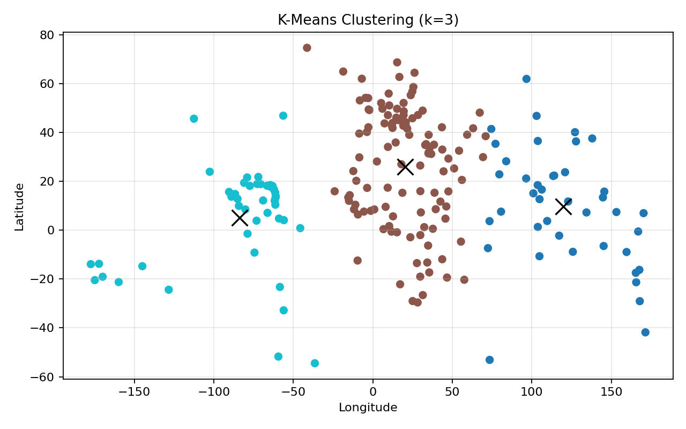
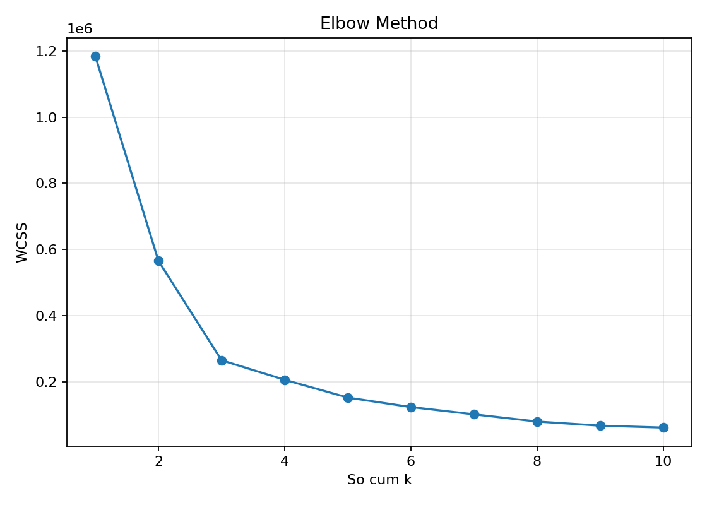

# Câu 3 - Phân cụm dữ liệu Countries bằng thuật toán K-means

## Đề bài

Cho tập dữ liệu `Countries.csv`. Hãy viết chương trình phân cụm bằng thuật toán K-means.

Yêu cầu:

1. Xây dựng hàm đo khoảng cách sử dụng độ đo Euclid.
2. Xây dựng hàm chứa thuật toán K-means để phân cụm.
3. Xây dựng hàm để khảo sát việc lựa chọn `k`.

Chương trình được cài đặt trong file:

```text
cau3_kmeans.py
```

Trong bài này, em chỉ dùng:

- `numpy` để tính toán mảng và giá trị trung bình.
- `matplotlib` để vẽ biểu đồ.
- `csv` và `pathlib` là thư viện chuẩn của Python để đọc/ghi file.

Không dùng thư viện K-means có sẵn như `sklearn.cluster.KMeans`.

---

## a) Xây dựng hàm đo khoảng cách sử dụng độ đo Euclid

### Trả lời: Hàm khoảng cách Euclid

Mỗi quốc gia trong `Countries.csv` được biểu diễn bằng 2 đặc trưng:

- `Longitude`: kinh độ
- `Latitude`: vĩ độ

Ta coi mỗi quốc gia là một điểm trong mặt phẳng 2 chiều:

```text
P = (Longitude, Latitude)
```

Giả sử có hai điểm:

```text
A = (x1, y1)
B = (x2, y2)
```

Khoảng cách Euclid giữa hai điểm được tính theo công thức:

```text
d(A, B) = sqrt((x1 - x2)^2 + (y1 - y2)^2)
```

Trong thuật toán K-means, khoảng cách Euclid được dùng để xác định một điểm dữ liệu gần tâm cụm nào nhất. Điểm dữ liệu sẽ được gán vào cụm có tâm gần nhất.

### Trả lời: Dán code hàm tính khoảng cách

```python
def euclidean_distance(point_a, point_b):
    return np.sqrt(np.sum((point_a - point_b) ** 2))
```

Giải thích:

- `point_a - point_b`: tính hiệu từng tọa độ.
- `(...) ** 2`: bình phương từng hiệu.
- `np.sum(...)`: cộng các bình phương.
- `np.sqrt(...)`: lấy căn bậc hai để ra khoảng cách Euclid.

Ví dụ:

```text
A = (2, 3)
B = (5, 7)

d(A, B) = sqrt((2 - 5)^2 + (3 - 7)^2)
        = sqrt(9 + 16)
        = 5
```

---

## b) Xây dựng hàm chứa thuật toán K-means để phân cụm

### Trả lời: Ý tưởng thuật toán K-means

K-means là thuật toán phân cụm không giám sát. Thuật toán không cần nhãn đúng ban đầu mà tự chia dữ liệu thành `k` nhóm dựa trên khoảng cách giữa các điểm.

Các bước chính:

1. Chọn số cụm `k`.
2. Khởi tạo ngẫu nhiên `k` tâm cụm ban đầu.
3. Với mỗi điểm dữ liệu, tính khoảng cách từ điểm đó đến từng tâm cụm.
4. Gán điểm dữ liệu vào cụm có tâm gần nhất.
5. Cập nhật lại tâm cụm bằng trung bình cộng các điểm trong cụm.
6. Lặp lại bước 3 đến bước 5 cho đến khi tâm cụm không thay đổi nhiều hoặc đạt số vòng lặp tối đa.

Trong bài này, dữ liệu phân cụm là:

```text
X = [Longitude, Latitude]
```

Sau khi chạy K-means, mỗi quốc gia được gán thêm một nhãn cụm `Cluster`.

### Trả lời: Dán code thuật toán K-means

Dưới đây là toàn bộ chương trình hoàn thiện. Có thể copy nguyên khối code này để chạy:

```python
from pathlib import Path
import csv

import matplotlib.pyplot as plt
import numpy as np


def euclidean_distance(point_a, point_b):
    return np.sqrt(np.sum((point_a - point_b) ** 2))


def initialize_centroids(X, k, rng):
    indices = rng.choice(len(X), size=k, replace=False)
    return X[indices].copy()


def assign_clusters(X, centroids):
    labels = []

    for point in X:
        distances = [euclidean_distance(point, centroid) for centroid in centroids]
        labels.append(int(np.argmin(distances)))

    return np.array(labels)


def update_centroids(X, labels, k, old_centroids, rng):
    centroids = old_centroids.copy()

    for cluster_id in range(k):
        points = X[labels == cluster_id]

        if len(points) > 0:
            centroids[cluster_id] = np.mean(points, axis=0)
        else:
            centroids[cluster_id] = X[rng.integers(len(X))]

    return centroids


def compute_wcss(X, labels, centroids):
    total = 0

    for point, label in zip(X, labels):
        total += euclidean_distance(point, centroids[label]) ** 2

    return total


def kmeans(X, k, max_iters=100, random_state=42):
    if k <= 0:
        raise ValueError("k phai lon hon 0")
    if k > len(X):
        raise ValueError("k khong duoc lon hon so diem du lieu")

    rng = np.random.default_rng(random_state)
    centroids = initialize_centroids(X, k, rng)

    for _ in range(max_iters):
        labels = assign_clusters(X, centroids)
        new_centroids = update_centroids(X, labels, k, centroids, rng)

        if np.allclose(centroids, new_centroids):
            break

        centroids = new_centroids

    labels = assign_clusters(X, centroids)
    wcss = compute_wcss(X, labels, centroids)

    return centroids, labels, wcss


def run_kmeans_best_of_n(X, k, n_init=20, max_iters=100):
    best_centroids = None
    best_labels = None
    best_wcss = float("inf")

    for seed in range(n_init):
        centroids, labels, wcss = kmeans(X, k, max_iters=max_iters, random_state=seed)

        if wcss < best_wcss:
            best_centroids = centroids
            best_labels = labels
            best_wcss = wcss

    return best_centroids, best_labels, best_wcss


def elbow_method(X, k_values):
    results = []

    for k in k_values:
        centroids, labels, wcss = run_kmeans_best_of_n(X, k)
        results.append((k, centroids, labels, wcss))

    return results


def find_data_file():
    current_dir = Path(__file__).resolve().parent
    project_dir = current_dir.parents[2]
    candidates = [
        current_dir / "Countries.csv",
        current_dir / "Countries-exercise.csv",
        project_dir / "Countries.csv",
        project_dir / "Countries-exercise.csv",
    ]

    for file_path in candidates:
        if file_path.exists():
            return file_path

    raise FileNotFoundError("Khong tim thay Countries.csv hoac Countries-exercise.csv")


def load_country_data(file_path):
    rows = []

    with open(file_path, newline="", encoding="utf-8-sig") as f:
        reader = csv.DictReader(f)

        for row in reader:
            row["Longitude"] = float(row["Longitude"])
            row["Latitude"] = float(row["Latitude"])
            rows.append(row)

    X = np.array([[row["Longitude"], row["Latitude"]] for row in rows], dtype=float)
    return rows, X


def save_clustered_csv(rows, labels, output_file):
    fieldnames = list(rows[0].keys())

    if "Cluster" not in fieldnames:
        fieldnames.append("Cluster")

    with open(output_file, "w", newline="", encoding="utf-8-sig") as f:
        writer = csv.DictWriter(f, fieldnames=fieldnames)
        writer.writeheader()

        for row, label in zip(rows, labels):
            output_row = row.copy()
            output_row["Cluster"] = int(label)
            writer.writerow(output_row)


def save_elbow_chart(k_values, wcss_values, output_file):
    plt.figure(figsize=(7, 5))
    plt.plot(k_values, wcss_values, marker="o")
    plt.xlabel("So cum k")
    plt.ylabel("WCSS")
    plt.title("Elbow Method")
    plt.grid(True, alpha=0.3)
    plt.tight_layout()
    plt.savefig(output_file, dpi=160)
    plt.close()


def save_cluster_chart(X, labels, centroids, output_file):
    plt.figure(figsize=(8, 5))
    plt.scatter(X[:, 0], X[:, 1], c=labels, cmap="tab10", s=35)
    plt.scatter(centroids[:, 0], centroids[:, 1], c="black", marker="x", s=180)
    plt.xlabel("Longitude")
    plt.ylabel("Latitude")
    plt.title(f"K-Means Clustering (k={len(centroids)})")
    plt.grid(True, alpha=0.3)
    plt.tight_layout()
    plt.savefig(output_file, dpi=160)
    plt.close()


def print_elbow_results(elbow_results):
    print("KET QUA ELBOW")
    print(f"{'k':>3} {'WCSS':>12}")

    for k, _, _, wcss in elbow_results:
        print(f"{k:>3} {wcss:>12.2f}")


def print_cluster_summary(data, centroids, labels):
    print()
    print("TAM CUM")
    print(f"{'Cum':>3} {'Longitude':>12} {'Latitude':>12} {'So nuoc':>8}")

    for cluster_id, centroid in enumerate(centroids):
        count = int(np.sum(labels == cluster_id))
        print(f"{cluster_id:>3} {centroid[0]:>12.4f} {centroid[1]:>12.4f} {count:>8}")

    print()
    print("20 DONG DU LIEU DA PHAN CUM DAU TIEN")
    print(f"{'name':>25} {'Longitude':>12} {'Latitude':>12} {'Cluster':>8}")

    for row, label in zip(data[:20], labels[:20]):
        print(
            f"{row['name']:>25} "
            f"{row['Longitude']:>12.6f} "
            f"{row['Latitude']:>12.6f} "
            f"{int(label):>8}"
        )


def main():
    current_dir = Path(__file__).resolve().parent
    data_file = find_data_file()
    data, X = load_country_data(data_file)

    k_values = list(range(1, 11))
    elbow_results = elbow_method(X, k_values)
    wcss_values = [item[3] for item in elbow_results]

    chosen_k = 3
    centroids, labels, wcss = run_kmeans_best_of_n(X, chosen_k)

    elbow_image = current_dir / "cau3_elbow.png"
    cluster_image = current_dir / "cau3_clusters.png"
    output_csv = current_dir / "cau3_countries_clustered.csv"

    save_elbow_chart(k_values, wcss_values, elbow_image)
    save_cluster_chart(X, labels, centroids, cluster_image)
    save_clustered_csv(data, labels, output_csv)

    print(f"File du lieu: {data_file}")
    print_elbow_results(elbow_results)
    print_cluster_summary(data, centroids, labels)
    print()
    print(f"Da luu bieu do elbow: {elbow_image}")
    print(f"Da luu bieu do phan cum: {cluster_image}")
    print(f"Da luu ket qua phan cum: {output_csv}")
    print(f"K duoc chon: {chosen_k}, WCSS = {wcss:.2f}")


if __name__ == "__main__":
    main()

```

### Biểu đồ phân cụm với k = 3

Sau khi khảo sát `k`, em chọn `k = 3` để phân cụm dữ liệu các quốc gia.



Nhận xét:

- Mỗi màu là một cụm quốc gia.
- Trục hoành là `Longitude`.
- Trục tung là `Latitude`.
- Dấu `x` màu đen là tâm cụm.
- Vì dữ liệu là kinh độ và vĩ độ, các cụm thể hiện sự gần nhau tương đối về vị trí địa lý.

Tâm các cụm khi chọn `k = 3`:

| Cụm | Longitude | Latitude | Số nước |
|---:|---:|---:|---:|
| 0 | 119.8963 | 9.6460 | 41 |
| 1 | 20.3056 | 25.9904 | 113 |
| 2 | -83.7257 | 5.0822 | 46 |

---

## c) Xây dựng hàm để khảo sát việc lựa chọn k

### Trả lời: Phương pháp chọn k

Để khảo sát số cụm `k`, em sử dụng phương pháp **Elbow Method**.

Ý tưởng:

1. Chạy K-means với nhiều giá trị `k`, ví dụ từ 1 đến 10.
2. Với mỗi giá trị `k`, tính tổng bình phương khoảng cách từ các điểm đến tâm cụm tương ứng.
3. Giá trị này gọi là WCSS.
4. Vẽ biểu đồ WCSS theo `k`.
5. Chọn `k` tại vị trí đường cong bắt đầu giảm chậm lại, gọi là điểm khuỷu tay.

WCSS được tính như sau:

```text
WCSS = tổng khoảng cách bình phương từ từng điểm đến tâm cụm của nó
```

Nếu `k` tăng thì WCSS thường giảm. Tuy nhiên, không nên chọn `k` quá lớn vì số cụm nhiều sẽ làm mô hình khó diễn giải. Vì vậy, ta chọn `k` tại điểm cân bằng giữa WCSS nhỏ và số cụm vừa phải.

### Trả lời: Dán code khảo sát k

Code tính WCSS:

```python
def compute_wcss(X, labels, centroids):
    total = 0

    for point, label in zip(X, labels):
        total += euclidean_distance(point, centroids[label]) ** 2

    return total
```

Code chạy K-means nhiều lần để lấy kết quả tốt nhất:

```python
def run_kmeans_best_of_n(X, k, n_init=20, max_iters=100):
    best_centroids = None
    best_labels = None
    best_wcss = float("inf")

    for seed in range(n_init):
        centroids, labels, wcss = kmeans(X, k, max_iters=max_iters, random_state=seed)

        if wcss < best_wcss:
            best_centroids = centroids
            best_labels = labels
            best_wcss = wcss

    return best_centroids, best_labels, best_wcss
```

Code khảo sát nhiều giá trị `k`:

```python
def elbow_method(X, k_values):
    results = []

    for k in k_values:
        centroids, labels, wcss = run_kmeans_best_of_n(X, k)
        results.append((k, centroids, labels, wcss))

    return results
```

Code vẽ biểu đồ Elbow:

```python
def save_elbow_chart(k_values, wcss_values, output_file):
    plt.figure(figsize=(7, 5))
    plt.plot(k_values, wcss_values, marker="o")
    plt.xlabel("So cum k")
    plt.ylabel("WCSS")
    plt.title("Elbow Method")
    plt.grid(True, alpha=0.3)
    plt.tight_layout()
    plt.savefig(output_file, dpi=160)
    plt.close()
```

### Biểu đồ Elbow



Kết quả khảo sát WCSS:

| k | WCSS |
|---:|---:|
| 1 | 1184443.06 |
| 2 | 565269.22 |
| 3 | 264675.95 |
| 4 | 205635.32 |
| 5 | 151819.98 |
| 6 | 123190.06 |
| 7 | 101082.70 |
| 8 | 79332.18 |
| 9 | 66944.27 |
| 10 | 61108.94 |

Mức giảm WCSS khi tăng `k`:

| Tăng k | Mức giảm WCSS | Tỉ lệ giảm |
|---:|---:|---:|
| 1 -> 2 | 619173.84 | 52.28% |
| 2 -> 3 | 300593.27 | 53.18% |
| 3 -> 4 | 59040.63 | 22.31% |
| 4 -> 5 | 53815.34 | 26.17% |
| 5 -> 6 | 28629.92 | 18.86% |
| 6 -> 7 | 22107.36 | 17.95% |
| 7 -> 8 | 21750.52 | 21.52% |
| 8 -> 9 | 12387.91 | 15.62% |
| 9 -> 10 | 5835.33 | 8.72% |

### Trả lời: Lựa chọn k

Quan sát bảng WCSS và biểu đồ Elbow:

- WCSS giảm rất mạnh khi tăng `k` từ 1 đến 3.
- Sau `k = 3`, mức giảm WCSS nhỏ hơn rõ rệt so với giai đoạn đầu.
- Khi tăng từ `k = 3` lên `k = 4`, WCSS chỉ giảm thêm `59040.63`, thấp hơn nhiều so với mức giảm `619173.84` từ `k = 1` lên `k = 2` và `300593.27` từ `k = 2` lên `k = 3`.
- Với dữ liệu kinh độ và vĩ độ, `k = 3` cho kết quả phân cụm gọn, dễ quan sát và phù hợp với điểm khuỷu tay trên biểu đồ Elbow.

Vì vậy, trong bài này em chọn:

```text
k = 3
```

Kết quả cuối cùng:

```text
K duoc chon: 3
WCSS = 264675.95
```

---

## Thực thi chương trình

Lệnh chạy:

```powershell
python "2025/De2/Kmeans_Cau3/cau3_kmeans.py"
```

Kết quả chạy chính:

```text
KET QUA ELBOW
  k         WCSS
  1   1184443.06
  2    565269.22
  3    264675.95
  4    205635.32
  5    151819.98
  6    123190.06
  7    101082.70
  8     79332.18
  9     66944.27
 10     61108.94

TAM CUM
Cum    Longitude     Latitude  So nuoc
  0     119.8963       9.6460       41
  1      20.3056      25.9904      113
  2     -83.7257       5.0822       46

K duoc chon: 3, WCSS = 264675.95
```

Các file kết quả:

```text
cau3_elbow.png
cau3_clusters.png
cau3_countries_clustered.csv
```

---

## Kết luận

Chương trình đã hoàn thành các yêu cầu:

- Có hàm đo khoảng cách Euclid.
- Có thuật toán K-means tự cài đặt, không dùng thư viện phân cụm có sẵn.
- Có hàm khảo sát lựa chọn `k` bằng Elbow Method.
- Có biểu đồ Elbow để chọn `k`.
- Có biểu đồ phân cụm sau khi chọn `k = 3`.
- Có file kết quả `cau3_countries_clustered.csv` chứa nhãn cụm của từng quốc gia.


