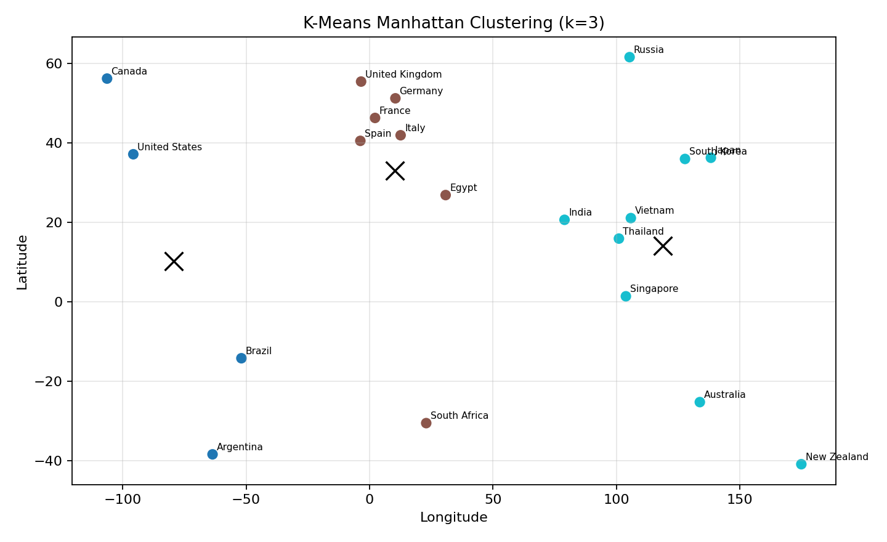
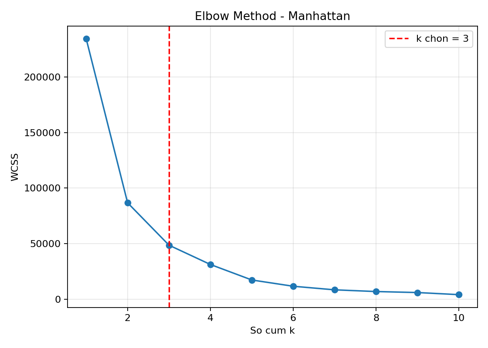

# Câu 3 - Phân cụm bằng thuật toán K-means dùng khoảng cách Manhattan

## Đề bài

Hãy viết chương trình phân cụm bằng thuật toán K-means.

Yêu cầu:

1. Xây dựng hàm đo khoảng cách sử dụng độ đo Manhattan.
2. Xây dựng hàm chứa thuật toán K-means để phân cụm.
3. Xây dựng hàm để khảo sát việc lựa chọn `k` với tập dữ liệu quốc gia đã cho.

Dữ liệu dùng trong bài là `data_list`, mỗi dòng gồm:

```text
[name, Longitude, Latitude]
```

Chương trình được cài đặt trong file:

```text
cau3_kmeans_manhattan.py
```

Kết quả chương trình xuất ra:

- `cau3_kmeans_manhattan_out.txt`: kết quả chạy chương trình.
- `cau3_countries_manhattan_clustered.csv`: dữ liệu sau khi gán cụm.
- `cau3_manhattan_elbow.png`: biểu đồ khảo sát chọn `k`.
- `cau3_manhattan_clusters.png`: biểu đồ phân cụm.

Trong bài này không dùng thư viện K-means có sẵn như `sklearn.cluster.KMeans`. Thuật toán được cài đặt thủ công bằng `numpy`.

## a) Xây dựng hàm đo khoảng cách sử dụng độ đo Manhattan

### Trả lời: Minh hoạ tính khoảng cách

Mỗi quốc gia được biểu diễn bằng 2 đặc trưng:

- `Longitude`: kinh độ
- `Latitude`: vĩ độ

Ta coi mỗi quốc gia là một điểm trong mặt phẳng 2 chiều:

```text
P = (Longitude, Latitude)
```

Giả sử có hai điểm:

```text
A = (x1, y1)
B = (x2, y2)
```

Khoảng cách Manhattan giữa hai điểm được tính theo công thức:

```text
d(A, B) = |x1 - x2| + |y1 - y2|
```

Ví dụ với hai quốc gia trong đề:

```text
Vietnam = (105.8342, 21.0278)
Japan   = (138.2529, 36.2048)

d(Vietnam, Japan)
= |105.8342 - 138.2529| + |21.0278 - 36.2048|
= 32.4187 + 15.1770
= 47.5957
```

Trong K-means, khoảng cách Manhattan được dùng ở bước gán cụm: một điểm dữ liệu sẽ được gán vào cụm có tâm gần nó nhất theo tổng độ lệch tuyệt đối trên từng chiều.

### Trả lời: Dán code hàm tính khoảng cách

```python
def manhattan_distance(point_a, point_b):
    return np.sum(np.abs(point_a - point_b))
```

Giải thích:

- `point_a - point_b`: tính hiệu từng tọa độ.
- `np.abs(...)`: lấy trị tuyệt đối từng hiệu.
- `np.sum(...)`: cộng các độ lệch tuyệt đối để ra khoảng cách Manhattan.

## b) Xây dựng hàm chứa thuật toán K-means để phân cụm

### Trả lời: Dán code về hàm

Thuật toán K-means trong bài này gồm các bước:

1. Chọn số cụm `k`.
2. Khởi tạo ngẫu nhiên `k` tâm cụm ban đầu.
3. Với mỗi điểm dữ liệu, tính khoảng cách Manhattan đến từng tâm cụm.
4. Gán điểm vào cụm có tâm gần nhất.
5. Cập nhật lại tâm cụm bằng trung bình cộng các điểm trong cụm.
6. Lặp lại bước gán cụm và cập nhật tâm cụm cho đến khi tâm cụm ổn định hoặc đạt số vòng lặp tối đa.
7. Tính WCSS để đánh giá độ chặt của các cụm.

Các hàm chính dùng cho K-means:

```python
def initialize_centroids(X, k, rng):
    indices = rng.choice(len(X), size=k, replace=False)
    return X[indices].copy()


def assign_clusters(X, centroids):
    labels = []

    for point in X:
        distances = [manhattan_distance(point, centroid) for centroid in centroids]
        labels.append(int(np.argmin(distances)))

    return np.array(labels)


def update_centroids(X, labels, k, old_centroids, rng):
    centroids = old_centroids.copy()

    for cluster_id in range(k):
        points = X[labels == cluster_id]

        if len(points) > 0:
            centroids[cluster_id] = np.mean(points, axis=0)
        else:
            centroids[cluster_id] = X[rng.integers(len(X))]

    return centroids


def compute_wcss(X, labels, centroids):
    total = 0

    for point, label in zip(X, labels):
        total += manhattan_distance(point, centroids[label]) ** 2

    return total


def kmeans_manhattan(X, k, max_iters=100, random_state=42):
    if k <= 0:
        raise ValueError("k phai lon hon 0")
    if k > len(X):
        raise ValueError("k khong duoc lon hon so diem du lieu")

    rng = np.random.default_rng(random_state)
    centroids = initialize_centroids(X, k, rng)

    for _ in range(max_iters):
        labels = assign_clusters(X, centroids)
        new_centroids = update_centroids(X, labels, k, centroids, rng)

        if np.allclose(centroids, new_centroids):
            break

        centroids = new_centroids

    labels = assign_clusters(X, centroids)
    wcss = compute_wcss(X, labels, centroids)

    return centroids, labels, wcss
```

Ghi chú: đề yêu cầu thuật toán K-means, nên tâm cụm được cập nhật bằng trung bình cộng. Khoảng cách dùng để gán cụm là Manhattan theo yêu cầu của câu a.

## c) Xây dựng hàm để khảo sát việc lựa chọn k

### Trả lời: Dán code về hàm và giải thích cách lựa chọn k phù hợp

Cách khảo sát `k` dùng phương pháp Elbow:

1. Chạy K-means với nhiều giá trị `k`, ở đây là từ `1` đến `10`.
2. Với mỗi `k`, tính WCSS.
3. WCSS càng nhỏ thì các điểm càng gần tâm cụm, nhưng nếu tăng `k` quá nhiều thì mô hình bị chia nhỏ quá mức.
4. Chọn `k` tại vị trí khuỷu tay, nơi WCSS bắt đầu giảm chậm lại rõ rệt.
5. Trong code, hàm `choose_k_by_elbow` chọn điểm có khoảng cách xa nhất tới đường nối giữa điểm đầu và điểm cuối của đồ thị WCSS. Với dữ liệu này, kết quả chọn được là `k = 3`.

Code khảo sát `k`:

```python
def run_kmeans_best_of_n(X, k, n_init=30, max_iters=100):
    best_centroids = None
    best_labels = None
    best_wcss = float("inf")

    for seed in range(n_init):
        centroids, labels, wcss = kmeans_manhattan(
            X,
            k,
            max_iters=max_iters,
            random_state=seed,
        )

        if wcss < best_wcss:
            best_centroids = centroids
            best_labels = labels
            best_wcss = wcss

    return best_centroids, best_labels, best_wcss


def elbow_method(X, k_values):
    results = []

    for k in k_values:
        centroids, labels, wcss = run_kmeans_best_of_n(X, k)
        results.append((k, centroids, labels, wcss))

    return results


def choose_k_by_elbow(elbow_results):
    points = np.array([[k, wcss] for k, _, _, wcss in elbow_results], dtype=float)
    start = points[0]
    end = points[-1]
    line = end - start
    line_norm = np.linalg.norm(line)

    if line_norm == 0:
        return int(points[0][0])

    distances = []

    for point in points:
        numerator = abs(line[0] * (start[1] - point[1]) - line[1] * (start[0] - point[0]))
        distance = numerator / line_norm
        distances.append(distance)

    best_index = int(np.argmax(distances))
    return int(points[best_index][0])
```

### Trả lời: Dán kết quả thi với k, có giải thích và bình luận

Kết quả khảo sát WCSS:

```text
k         WCSS
1    234543.46
2     86781.87
3     48592.37
4     31217.34
5     17259.64
6     11616.00
7      8389.32
8      6858.00
9      5946.14
10     4057.19
```

Chọn `k = 3` vì từ `k = 1` đến `k = 3`, WCSS giảm rất mạnh. Sau `k = 3`, WCSS vẫn tiếp tục giảm nhưng mức giảm dần chậm hơn. Vì vậy `k = 3` là điểm cân bằng hợp lý giữa số cụm và độ chặt của cụm.

Với `k = 3`, kết quả tâm cụm:

```text
Cum    Longitude     Latitude  So nuoc
0       -79.4004      10.1424        4
1        10.2553      33.0526        7
2       118.8455      14.0339        9
```

Kết quả phân cụm:

```text
Cluster 0: United States, Canada, Brazil, Argentina
Cluster 1: France, Germany, United Kingdom, Italy, Spain, South Africa, Egypt
Cluster 2: Vietnam, Japan, South Korea, Australia, India, Thailand, Singapore, New Zealand, Russia
```

Bình luận:

- `Cluster 0` gồm các quốc gia ở khu vực châu Mỹ.
- `Cluster 1` chủ yếu gồm các quốc gia châu Âu và một số điểm gần hơn về kinh độ như Egypt, South Africa.
- `Cluster 2` gồm nhiều quốc gia châu Á - Thái Bình Dương, cùng Australia và New Zealand.
- Vì dữ liệu chỉ dùng `Longitude` và `Latitude`, cụm phản ánh vị trí địa lý tương đối, không phản ánh kinh tế, văn hoá hay dân số.

Biểu đồ phân cụm:



Biểu đồ Elbow:



## Giải thích chương trình

| Thành phần | Vai trò |
|---|---|
| `DATA_LIST` | Lưu dữ liệu đầu vào gồm tên quốc gia, kinh độ và vĩ độ. |
| `load_country_data()` | Chuyển `DATA_LIST` thành danh sách dòng dữ liệu và ma trận `X`. |
| `manhattan_distance()` | Tính khoảng cách Manhattan giữa hai điểm. |
| `initialize_centroids()` | Chọn ngẫu nhiên `k` điểm làm tâm cụm ban đầu. |
| `assign_clusters()` | Gán mỗi điểm vào cụm có tâm gần nhất theo khoảng cách Manhattan. |
| `update_centroids()` | Cập nhật tâm cụm bằng trung bình cộng các điểm trong cụm. |
| `compute_wcss()` | Tính WCSS để đánh giá độ chặt của cụm. |
| `kmeans_manhattan()` | Thực hiện vòng lặp K-means: gán cụm, cập nhật tâm, kiểm tra dừng. |
| `run_kmeans_best_of_n()` | Chạy K-means nhiều lần và lấy kết quả có WCSS nhỏ nhất. |
| `elbow_method()` | Chạy K-means với nhiều giá trị `k` để khảo sát chọn số cụm. |
| `choose_k_by_elbow()` | Tự chọn `k` tại điểm khuỷu tay của đồ thị WCSS. |
| `main()` | Điều phối toàn bộ chương trình và in kết quả. |

## Code hoàn thiện
```python
from pathlib import Path
import csv

import matplotlib.pyplot as plt
import numpy as np


DATA_LIST = [
    ["Vietnam", 105.8342, 21.0278],
    ["Japan", 138.2529, 36.2048],
    ["South Korea", 127.7669, 35.9078],
    ["Australia", 133.7751, -25.2744],
    ["France", 2.2137, 46.2276],
    ["Germany", 10.4515, 51.1657],
    ["United Kingdom", -3.436, 55.3781],
    ["Italy", 12.5674, 41.8719],
    ["Spain", -3.7492, 40.4637],
    ["United States", -95.7129, 37.0902],
    ["Canada", -106.3468, 56.1304],
    ["Brazil", -51.9253, -14.235],
    ["Argentina", -63.6167, -38.4161],
    ["South Africa", 22.9375, -30.5595],
    ["Egypt", 30.8025, 26.8206],
    ["India", 78.9629, 20.5937],
    ["Thailand", 100.9925, 15.87],
    ["Singapore", 103.8198, 1.3521],
    ["New Zealand", 174.886, -40.9006],
    ["Russia", 105.3188, 61.524],
]


def manhattan_distance(point_a, point_b):
    return np.sum(np.abs(point_a - point_b))


def load_country_data(data_list):
    rows = []

    for name, longitude, latitude in data_list:
        rows.append({
            "name": name,
            "Longitude": float(longitude),
            "Latitude": float(latitude),
        })

    X = np.array([[row["Longitude"], row["Latitude"]] for row in rows], dtype=float)
    return rows, X


def initialize_centroids(X, k, rng):
    indices = rng.choice(len(X), size=k, replace=False)
    return X[indices].copy()


def assign_clusters(X, centroids):
    labels = []

    for point in X:
        distances = [manhattan_distance(point, centroid) for centroid in centroids]
        labels.append(int(np.argmin(distances)))

    return np.array(labels)


def update_centroids(X, labels, k, old_centroids, rng):
    centroids = old_centroids.copy()

    for cluster_id in range(k):
        points = X[labels == cluster_id]

        if len(points) > 0:
            centroids[cluster_id] = np.mean(points, axis=0)
        else:
            centroids[cluster_id] = X[rng.integers(len(X))]

    return centroids


def compute_wcss(X, labels, centroids):
    total = 0

    for point, label in zip(X, labels):
        total += manhattan_distance(point, centroids[label]) ** 2

    return total


def kmeans_manhattan(X, k, max_iters=100, random_state=42):
    if k <= 0:
        raise ValueError("k phai lon hon 0")
    if k > len(X):
        raise ValueError("k khong duoc lon hon so diem du lieu")

    rng = np.random.default_rng(random_state)
    centroids = initialize_centroids(X, k, rng)

    for _ in range(max_iters):
        labels = assign_clusters(X, centroids)
        new_centroids = update_centroids(X, labels, k, centroids, rng)

        if np.allclose(centroids, new_centroids):
            break

        centroids = new_centroids

    labels = assign_clusters(X, centroids)
    wcss = compute_wcss(X, labels, centroids)

    return centroids, labels, wcss


def run_kmeans_best_of_n(X, k, n_init=30, max_iters=100):
    best_centroids = None
    best_labels = None
    best_wcss = float("inf")

    for seed in range(n_init):
        centroids, labels, wcss = kmeans_manhattan(
            X,
            k,
            max_iters=max_iters,
            random_state=seed,
        )

        if wcss < best_wcss:
            best_centroids = centroids
            best_labels = labels
            best_wcss = wcss

    return best_centroids, best_labels, best_wcss


def elbow_method(X, k_values):
    results = []

    for k in k_values:
        centroids, labels, wcss = run_kmeans_best_of_n(X, k)
        results.append((k, centroids, labels, wcss))

    return results


def choose_k_by_elbow(elbow_results):
    points = np.array([[k, wcss] for k, _, _, wcss in elbow_results], dtype=float)
    start = points[0]
    end = points[-1]
    line = end - start
    line_norm = np.linalg.norm(line)

    if line_norm == 0:
        return int(points[0][0])

    distances = []

    for point in points:
        numerator = abs(line[0] * (start[1] - point[1]) - line[1] * (start[0] - point[0]))
        distance = numerator / line_norm
        distances.append(distance)

    best_index = int(np.argmax(distances))
    return int(points[best_index][0])


def save_clustered_csv(rows, labels, output_file):
    fieldnames = ["name", "Longitude", "Latitude", "Cluster"]

    with open(output_file, "w", newline="", encoding="utf-8-sig") as f:
        writer = csv.DictWriter(f, fieldnames=fieldnames)
        writer.writeheader()

        for row, label in zip(rows, labels):
            output_row = row.copy()
            output_row["Cluster"] = int(label)
            writer.writerow(output_row)


def save_elbow_chart(k_values, wcss_values, chosen_k, output_file):
    plt.figure(figsize=(7, 5))
    plt.plot(k_values, wcss_values, marker="o")
    plt.axvline(chosen_k, color="red", linestyle="--", label=f"k chon = {chosen_k}")
    plt.xlabel("So cum k")
    plt.ylabel("WCSS")
    plt.title("Elbow Method - Manhattan")
    plt.grid(True, alpha=0.3)
    plt.legend()
    plt.tight_layout()
    plt.savefig(output_file, dpi=160)
    plt.close()


def save_cluster_chart(X, labels, centroids, rows, output_file):
    plt.figure(figsize=(9, 5.5))
    plt.scatter(X[:, 0], X[:, 1], c=labels, cmap="tab10", s=45)
    plt.scatter(centroids[:, 0], centroids[:, 1], c="black", marker="x", s=180)

    for row in rows:
        plt.annotate(
            row["name"],
            (row["Longitude"], row["Latitude"]),
            fontsize=7,
            xytext=(3, 3),
            textcoords="offset points",
        )

    plt.xlabel("Longitude")
    plt.ylabel("Latitude")
    plt.title(f"K-Means Manhattan Clustering (k={len(centroids)})")
    plt.grid(True, alpha=0.3)
    plt.tight_layout()
    plt.savefig(output_file, dpi=160)
    plt.close()


def print_distance_example():
    vietnam = np.array([105.8342, 21.0278])
    japan = np.array([138.2529, 36.2048])
    distance = manhattan_distance(vietnam, japan)

    print("MINH HOA KHOANG CACH MANHATTAN")
    print("Vietnam = (105.8342, 21.0278)")
    print("Japan   = (138.2529, 36.2048)")
    print("d(Vietnam, Japan) = |105.8342 - 138.2529| + |21.0278 - 36.2048|")
    print(f"                   = {distance:.4f}")


def print_elbow_results(elbow_results):
    print()
    print("KET QUA KHAO SAT K - ELBOW")
    print(f"{'k':>3} {'WCSS':>12}")

    for k, _, _, wcss in elbow_results:
        print(f"{k:>3} {wcss:>12.2f}")


def print_cluster_summary(rows, centroids, labels):
    print()
    print("TAM CUM")
    print(f"{'Cum':>3} {'Longitude':>12} {'Latitude':>12} {'So nuoc':>8}")

    for cluster_id, centroid in enumerate(centroids):
        count = int(np.sum(labels == cluster_id))
        print(f"{cluster_id:>3} {centroid[0]:>12.4f} {centroid[1]:>12.4f} {count:>8}")

    print()
    print("KET QUA PHAN CUM")
    print(f"{'name':>18} {'Longitude':>12} {'Latitude':>12} {'Cluster':>8}")

    for row, label in zip(rows, labels):
        print(
            f"{row['name']:>18} "
            f"{row['Longitude']:>12.4f} "
            f"{row['Latitude']:>12.4f} "
            f"{int(label):>8}"
        )


def main():
    current_dir = Path(__file__).resolve().parent
    rows, X = load_country_data(DATA_LIST)

    k_values = list(range(1, 11))
    elbow_results = elbow_method(X, k_values)
    wcss_values = [item[3] for item in elbow_results]

    chosen_k = choose_k_by_elbow(elbow_results)
    centroids, labels, wcss = run_kmeans_best_of_n(X, chosen_k)

    elbow_image = current_dir / "cau3_manhattan_elbow.png"
    cluster_image = current_dir / "cau3_manhattan_clusters.png"
    output_csv = current_dir / "cau3_countries_manhattan_clustered.csv"

    save_elbow_chart(k_values, wcss_values, chosen_k, elbow_image)
    save_cluster_chart(X, labels, centroids, rows, cluster_image)
    save_clustered_csv(rows, labels, output_csv)

    print_distance_example()
    print_elbow_results(elbow_results)
    print()
    print(f"K duoc chon theo elbow: {chosen_k}")
    print_cluster_summary(rows, centroids, labels)
    print()
    print(f"Da luu bieu do elbow: {elbow_image}")
    print(f"Da luu bieu do phan cum: {cluster_image}")
    print(f"Da luu ket qua phan cum: {output_csv}")
    print(f"K duoc chon: {chosen_k}, WCSS = {wcss:.2f}")


if __name__ == "__main__":
    main()

```

## Kết quả chạy chương trình

```text
MINH HOA KHOANG CACH MANHATTAN
Vietnam = (105.8342, 21.0278)
Japan   = (138.2529, 36.2048)
d(Vietnam, Japan) = |105.8342 - 138.2529| + |21.0278 - 36.2048|
                   = 47.5957

KET QUA KHAO SAT K - ELBOW
  k         WCSS
  1    234543.46
  2     86781.87
  3     48592.37
  4     31217.34
  5     17259.64
  6     11616.00
  7      8389.32
  8      6858.00
  9      5946.14
 10      4057.19

K duoc chon theo elbow: 3

TAM CUM
Cum    Longitude     Latitude  So nuoc
  0     -79.4004      10.1424        4
  1      10.2553      33.0526        7
  2     118.8455      14.0339        9

KET QUA PHAN CUM
              name    Longitude     Latitude  Cluster
           Vietnam     105.8342      21.0278        2
             Japan     138.2529      36.2048        2
       South Korea     127.7669      35.9078        2
         Australia     133.7751     -25.2744        2
            France       2.2137      46.2276        1
           Germany      10.4515      51.1657        1
    United Kingdom      -3.4360      55.3781        1
             Italy      12.5674      41.8719        1
             Spain      -3.7492      40.4637        1
     United States     -95.7129      37.0902        0
            Canada    -106.3468      56.1304        0
            Brazil     -51.9253     -14.2350        0
         Argentina     -63.6167     -38.4161        0
      South Africa      22.9375     -30.5595        1
             Egypt      30.8025      26.8206        1
             India      78.9629      20.5937        2
          Thailand     100.9925      15.8700        2
         Singapore     103.8198       1.3521        2
       New Zealand     174.8860     -40.9006        2
            Russia     105.3188      61.5240        2

Da luu bieu do elbow: C:\Users\minht\OneDrive\Desktop\TriTueNhanTao\Cuoi Ki\2025\De3_Nhat\Cau3\Kmeans_Manhattan_Cau3\cau3_manhattan_elbow.png
Da luu bieu do phan cum: C:\Users\minht\OneDrive\Desktop\TriTueNhanTao\Cuoi Ki\2025\De3_Nhat\Cau3\Kmeans_Manhattan_Cau3\cau3_manhattan_clusters.png
Da luu ket qua phan cum: C:\Users\minht\OneDrive\Desktop\TriTueNhanTao\Cuoi Ki\2025\De3_Nhat\Cau3\Kmeans_Manhattan_Cau3\cau3_countries_manhattan_clustered.csv
K duoc chon: 3, WCSS = 48592.37

```
